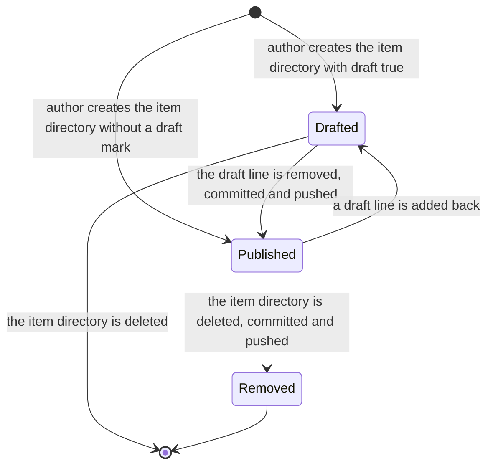
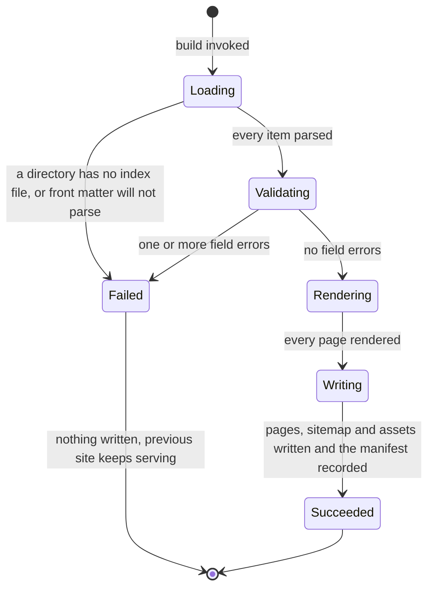
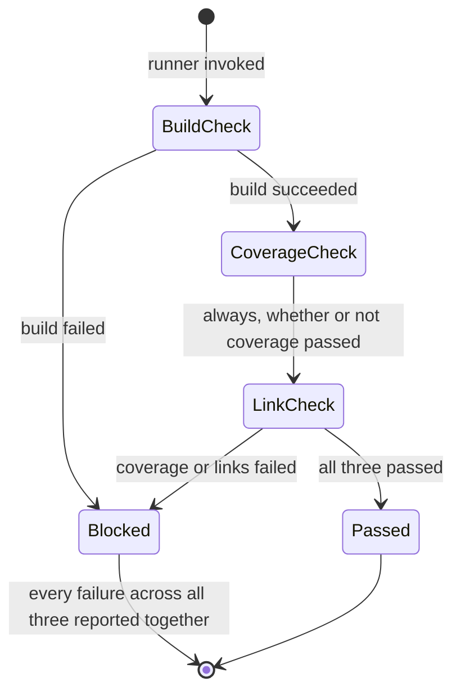
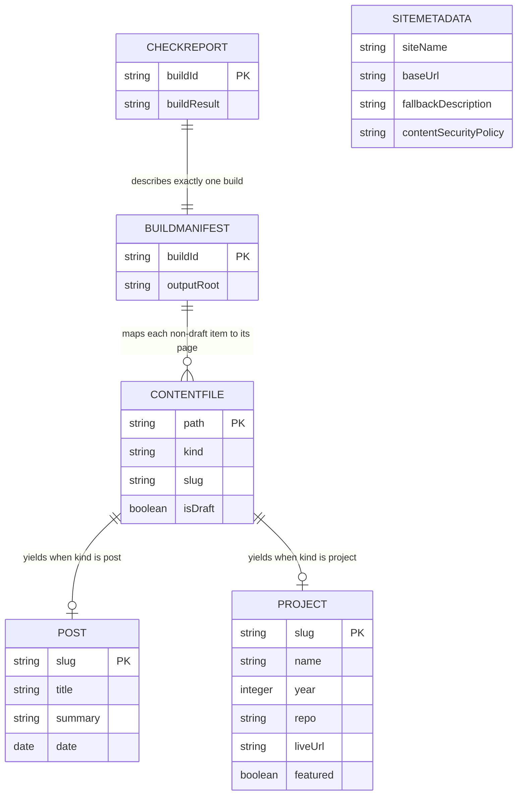

# Functional Specification — U1 Publishable Site Shell

The behaviour of the walking skeleton: the ordered step sequences the system
follows, and the state transitions its lifecycle entities pass through. This file
is the source of truth for **workflows and state machines**, because `entities.md`
(data shape) and `rules.md` (decision logic) capture neither ordered behaviour nor
transitions. Its entity-relationship diagram and rules summary are **derived
views** for readability — the YAML blocks in those two files remain authoritative.

U1 is the walking skeleton: every component in the catalogue at minimum depth,
reaching all the way from a file on disk to a live page. It is thin, not partial
— its definition of done is six pass/fail conditions it does not get to
reinterpret.

## Sources

- [upstream] `inception/units-generation/unit-of-work.md` — U1's boundary, what
  it delivers, and the constraint that its definition of done is not this stage's
  to write
- [upstream] `inception/units-generation/unit-of-work-story-map.md` — the 16
  functional requirements assigned to U1 and the recommended order within the
  unit, which W1's phase ordering follows
- [upstream] `inception/requirements-analysis/requirements.md` — FR1.1 to FR1.7,
  FR4.2 to FR4.6, FR5.2 to FR5.5, NFR2, NFR8 to NFR11, and constraints C1 to C4
- [upstream] `inception/domain-design/components.md` — the eight components, the
  acyclic dependency graph the workflows below traverse, and § Entity Ownership
- [upstream] `inception/domain-design/decisions.md` — ADR-001 (we write the
  build), ADR-004 (validation inside the build; one check runner), ADR-005
  (publishing through a workflow in this repository)
- [upstream] `inception/practices-discovery/team-practices.md` — the six
  walking-skeleton conditions and the pre-push timing of the check set
- [Q1]–[Q7] `functional-design-questions.md`

The declared `contract-summary` input is absent: Contract Design is SKIP in this
scope. There is exactly one deployable (`requirements.md` C1), so no inter-unit
API, message contract, or shared schema exists to formalise.

---

## Workflows

Seven ordered sequences. Each names the component that owns each step, so the
sequence and the catalogue cannot drift apart.

### W1 — Build the site

The core sequence. Phases run in a fixed order and validation is one of them,
never a separate command that can be bypassed (ADR-004).

| # | Step | Owner | Notes |
|---|---|---|---|
| 1 | Walk `content/posts/` and `content/projects/`, one level deep | ContentSource | Nothing outside `content/` is read (BR1.1) |
| 2 | For each item directory, locate its `index.md` | ContentSource | A directory without one is a field error (BR1.2) |
| 3 | Derive `kind` from the top directory and `slug` from the item directory name | ContentSource | BR1.3, BR1.4 |
| 4 | Split front matter from body and parse the front matter | ContentSource | An unparseable block is a field error naming the file (BR1.9) |
| 5 | Read the draft mark | ContentSource | `draft: true` and only that (BR1.6) |
| 6 | Drop every draft from everything downstream | ContentSource | One exclusion point, not one per consumer (BR1.7) |
| 7 | Check slug uniqueness within each kind | ContentSource | BR1.5 |
| 8 | Hand post items to PostCatalog, project items to ProjectCatalog | ContentSource | |
| 9 | Validate post fields; return field errors | PostCatalog | BR2.1–BR2.3 |
| 10 | Validate project fields; return field errors | ProjectCatalog | BR3.1–BR3.6 |
| 11 | Collect every field error from steps 2, 3, 4, 7, 9 and 10 | SiteBuilder | All of them, not the first (BR4.2) |
| 12 | **If any field error exists**: report each one naming its file and field, then abort | SiteBuilder | Nothing is written at all (BR4.3, BR4.4) |
| 13 | Order posts by date descending, ties by slug | PostCatalog | Never by file mtime (BR2.4) |
| 14 | Order projects featured-first, then year descending, then slug | ProjectCatalog | BR3.7 |
| 15 | Render each page: shell, head metadata, content-security policy, body | PageRenderer | BR5.1, BR5.8–BR5.10 |
| 16 | Render post and project bodies from Markdown, code coloured at build time | MarkupRenderer | Build time only; nothing runs in the reader's browser (NFR2) |
| 17 | Construct the sitemap document | ContentTransforms | Returned as text; writing is step 19's job |
| 18 | Write every page to the output directory | SiteBuilder | |
| 19 | Write the sitemap | SiteBuilder | BR5.11 |
| 20 | Copy each item's asset files beside its page | SiteBuilder | Files other than `index.md` in an item directory |
| 21 | Record the build manifest | SiteBuilder | One `sourceToOutput` row per non-draft item |

Steps 15 to 21 are reached only when step 12 found nothing. That is the whole of
the fail-loudly contract: a build either writes a complete site or writes nothing.

**Step 11's list of sources is exhaustive, and step 3 belongs in it.** Step 3
derives the slug and validates its shape against BR1.4 — lowercase, kebab-case,
ASCII — and a slug that fails is a field error like any other. Without step 3 in
the aggregate, a malformed directory name would never reach the report that names
the file and the field, which is the single capability this unit exists to
deliver (BR4.3). The six sources are steps 2, 3, 4, 7, 9 and 10; any future check
that can raise a field error is added to that list at the same time it is added
to the phase.

**Ordering within the unit** follows the story map: the build spine first, then
the shell and its head metadata, then Home and 404, then the publishing route
last — because the publishing route is what the skeleton's six conditions are
checked against, and checking them requires everything before it to exist.

### W2 — Run the three blocking checks

Invoked by the author before a push, and by the publishing route as a backstop.
One runner, so the two cannot drift (ADR-004).

| # | Step | Owner | Notes |
|---|---|---|---|
| 1 | Run W1 | CheckRunner → SiteBuilder | This is check 1 |
| 2 | If W1 failed, record `buildResult: fail` and both other results as `not-run` | CheckRunner | A `not-run` is never a pass (BR6.5) |
| 3 | If W1 succeeded, read the build manifest | CheckRunner | |
| 4 | For each `sourceToOutput` row, confirm its output page exists | CheckRunner | Check 2; drafts have no row, so they are not reported (BR6.2) |
| 5 | Collect every internal link in the built output | CheckRunner | |
| 6 | Confirm each internal link's target page exists | CheckRunner | Check 3 (BR6.3) |
| 7 | Skip every external link without checking it | CheckRunner | Never build-blocking (BR6.4) |
| 8 | Report all three outcomes together with every failure | CheckRunner | Not just the first (BR6.1) |
| 9 | Block if any result is `fail` | CheckRunner | BR6.5 |

### W3 — Publish a page

The mandated author flow, and the reason most other decisions are shaped the way
they are: write a file, commit it, push it, and the page is live.

| # | Step | Actor | Notes |
|---|---|---|---|
| 1 | Create `content/posts/<slug>/index.md` with its front matter and body | Author | The directory name becomes the URL, permanently (BR1.4, NFR8) |
| 2 | Run W2 locally | Author | Required before the push (NFR9) |
| 3 | Fix anything the check run reports, and re-run it | Author | Any failure blocks (BR6.5) |
| 4 | Commit and push to `main` | Author | Content commits go direct to `main`; code takes a branch |
| 5 | The publishing route triggers on the push | Publishing route | The only trigger there is (BR7.1) |
| 6 | The route runs W2 as a remote backstop | Publishing route | The same runner the author ran |
| 7 | If it passes, deploy the built output | Publishing route | Only a complete build deploys (BR7.3) |
| 8 | If it fails, deploy nothing; the previous site stays live | Publishing route | BR4.5 |
| 9 | Load the live URL and confirm the new page is reachable | Author | The smoke check; this site's only failure detection |

**No step 10 exists, and that is the requirement.** There is no publish button,
no dashboard, and no manual trigger (BR7.2). Step 9 is the author looking at
their own site, not an action the system requires.

**The residual gap is real.** Step 8's failure is visible in the repository's
Actions view but nowhere else; without step 9 a remote-only failure leaves the old
site quietly serving. That gap is `requirements.md` OQ2 and it remains open — it
is narrowed here, not closed.

### W4 — Publish a draft

| # | Step | Actor | Notes |
|---|---|---|---|
| 1 | Delete the `draft: true` line from the item's front matter | Author | The only change required (BR1.8) |
| 2 | Run W2, commit, push | Author | As W3 steps 2 to 4 |
| 3 | The item appears on its page, in its list, on Home, and in the sitemap | Build | It had none of these before (BR1.7) |

The file does not move and is not renamed, so its URL is the one it would always
have had. That is why [Q1] chose a front-matter field over a `_drafts/` directory.

### W5 — Roll back a bad publish

| # | Step | Actor | Notes |
|---|---|---|---|
| 1 | Identify the commit that broke the site | Author | |
| 2 | `git revert` it on `main` and push | Author | Not a force-push; history is preserved |
| 3 | The publishing route rebuilds from the reverted state | Publishing route | W3 steps 5 to 8 |
| 4 | Confirm the live site is back to its previous state | Author | The smoke check again |

This is the complete rollback for site content, and it is cheap because the site
is static with no database, no migration, and no state outside the repository.
**It is rehearsed once, deliberately, as part of this unit** — condition 4 of the
six. A rollback nobody has run is a rollback we are guessing about.

It is **not** a rollback for a leaked credential: a revert leaves the old blob
reachable in history. That case is governed by the credential rule, and the order
is revoke at the issuer first, clean history second.

### W6 — A reader requests a path that matches no page

| # | Step | Actor | Notes |
|---|---|---|---|
| 1 | The platform finds no page at the requested path | Platform | |
| 2 | It serves the site's own 404 page | Platform | Configured by this unit (BR5.6) |
| 3 | The reader sees the global shell, a plain sentence, and links to Writing and Projects | Reader | Not the platform's default page |

### W7 — A build fails on malformed content

Worth writing as its own sequence because it is a condition U1 must prove, not
just a branch of W1.

| # | Step | Owner | Notes |
|---|---|---|---|
| 1 | A content file is missing a required field, or carries an unparseable date | — | |
| 2 | The owning catalogue returns a field error naming file and field | PostCatalog / ProjectCatalog | It does not skip the file |
| 3 | Every other field error in the same build is collected alongside it | SiteBuilder | BR4.2 |
| 4 | The build reports all of them and aborts before rendering | SiteBuilder | BR4.3, BR4.4 |
| 5 | Nothing is written: no page, no sitemap, no manifest | SiteBuilder | BR4.4 |
| 6 | On the publishing path, nothing is deployed and the previous site stays live | Publishing route | BR4.5, BR7.3 |

**Prove it before calling this unit done.** Commit a deliberately broken post,
confirm the build fails naming the file and the field, and confirm the previously
live site stays up.

---

## State machines

### Content item lifecycle

The states an authored item passes through, and what causes each transition.

<!-- Text fallback: an item begins either Drafted or Published, depending on
whether it was created with a draft mark. Removing the draft line moves it from
Drafted to Published; adding one back moves it the other way. Deleting a drafted
item ends its life with no published trace. Deleting a published item moves it to
Removed. -->

| State | What is true of the item | Where it appears |
|---|---|---|
| Drafted | `draft: true` in front matter | Nowhere in the output — no page, list entry, Home entry, sitemap entry, or manifest row |
| Published | No draft mark, and every required field valid | Its own page, its list, Home if recent or featured enough, the sitemap |
| Removed | The directory is gone | Nowhere. Its URL now serves the 404 page (W6) |

**The Published → Removed transition has a consequence worth naming.** The slug
was the URL, and NFR8 forbids a published slug ever changing — but it says
nothing about a page being deleted. A removed item's URL becomes a 404 for anyone
who bookmarked it. Nothing upstream decides whether that is acceptable, and this
unit does not invent an answer: it is recorded as an assumption below rather than
resolved by design.

### Build lifecycle

<!-- Text fallback: a build moves through Loading, Validating, Rendering and
Writing to Succeeded. It can reach Failed from Loading or from Validating. A
Failed build writes nothing at all and leaves the previously live site serving.
There is no path from Rendering or Writing back to Failed for content reasons,
because all content faults are found by the end of Validating. -->

**Failure is only reachable before anything is written.** That is the property
BR4.4 exists to guarantee: by the time the build starts writing, every content
fault has already been found. A failure during writing would be an infrastructure
fault rather than a content fault, and it is out of this unit's scope to recover
from — the unwritten or half-written output is simply not deployed.

### Check run lifecycle

<!-- Text fallback: the runner does the build check first. If the build failed it
goes straight to Blocked and the other two checks are recorded as not-run. If the
build succeeded it runs the coverage check and then the link check, and it runs
the link check whether or not coverage passed, so both sets of failures are
reported together. It ends Passed only when all three passed. -->

The one thing to notice: the link check runs **even when coverage already
failed**. Stopping early would hide the second set of failures and turn one fix
cycle into two.

---

## Derived view — entity relationships

Derived from `entities.md`, which remains the source of truth for types,
constraints, and cardinality.

<!-- Text fallback: a ContentFile yields at most one Post when its kind is post,
and at most one Project when its kind is project. A BuildManifest maps many
non-draft ContentFiles to the pages written from them. A CheckReport describes
exactly one BuildManifest. SiteMetadata stands alone as a single configuration
record with no relationship to the others. -->

`SiteMetadata` is deliberately unrelated to everything else: it is configuration
rather than authored content, and it is never discovered by the content walk.

---

## Derived view — rules by enforcement point

Derived from `rules.md`, which remains the source of truth for each rule's
statement, logic, and violation behaviour.

| Component | Rules | What it is answerable for |
|---|---|---|
| ContentSource | BR1.1–BR1.9 | The content-directory boundary, item identity, drafts |
| PostCatalog | BR2.1–BR2.4 | What a post is, and what order posts come in |
| ProjectCatalog | BR3.1–BR3.7 | What a project is, and what order projects come in |
| SiteBuilder | BR4.1–BR4.5, BR5.11 | Phase ordering, the fail-loudly contract, writing the output |
| PageRenderer | BR5.1–BR5.10, BR5.12 | The shell, seven templates, Home's intro, head metadata, the security policy |
| CheckRunner | BR6.1–BR6.5 | The three blocking checks, reported together |
| Publishing route — **not a component** | BR7.1–BR7.3 | One trigger, no post-push step, complete builds only. Deployment configuration, deliberately outside the catalogue (`components.md` § Rationale, ADR-005); see `rules.md` § Where the BR7 rules are enforced |
| ContentTransforms | — | Called by the above; carries no rule of its own in this unit |
| MarkupRenderer | — | Called by PageRenderer; its rules are U2's to complete |

**Eight of the nine rows above are components; the Publishing route is not.** It
is listed because BR7.1–BR7.3 have to be enforced somewhere and a table of
enforcement points that omitted them would hide three rules. It is marked rather
than quietly mixed in, because a reader looking `Publishing route` up in
`components.md` will not find it — by design, not by oversight.

Two components carry no rule here, and that is correct rather than an omission.
`ContentTransforms` holds the derived functions the other components call — the
rules about *what* those functions must produce live with the callers.
`MarkupRenderer` is present in the skeleton at minimum depth; the four-token
colour theme and the full Markdown element set are U2's requirements (story map
§ Cross-cutting: FR2.6 and FR2.7 are owned by U2 and touched by U1).

---

## How this unit satisfies its six conditions

`team-practices.md` § Walking Skeleton states six pass/fail conditions, and
`unit-of-work.md` is explicit that this unit's definition of done is not this
stage's to write. Mapping them to the behaviour specified above, so a Build and
Test run has something concrete to check:

| # | Condition | Specified by |
|---|---|---|
| 1 | The site is live at its real public URL with one post page and one project page | W3, W1 steps 15–21 |
| 2 | A committed file becomes a live page with no further author action | W3, BR7.1, BR7.2 |
| 3 | `GET /aidlc/` and `GET /aidlc/spaces/default/memory/project.md` both return 404 | BR1.1, W6 |
| 4 | The undo path has been exercised once, deliberately | W5 |
| 5 | `GET /definitely-not-a-page` returns our 404, not the platform's | BR5.6, W6 |
| 6 | The content-security policy is in place and the site works with it | BR5.10 |

Condition 4 is the one most likely to be skipped, because it is the only one that
requires deliberately breaking something that works.

---

## Assumptions & Open Questions

Recorded rather than resolved by invention, each with what would invalidate it.

| ID | Assumption | Invalidated by |
|---|---|---|
| FA1 | A removed item's URL becoming a 404 is acceptable. NFR8 forbids a published slug *changing*; nothing upstream addresses deletion, and this unit does not invent a tombstone or redirect mechanism. **Carried, not closed:** this is the one place NFR8 and content deletion genuinely interact, and no requirement in the current backlog covers it. It is carried to **Build and Test**, where the Published→Removed transition is exercised, and the decision it needs is a *requirements* decision rather than a design one — so if it is not settled there it belongs in the next requirements pass, not in a later unit's design. Named explicitly so the deferral has an owner rather than a hope. | A decision that deleted pages must keep serving something, which would need a new requirement — the platform offers no server-side redirects (C4). |
| FA2 | Asset files inside an item directory are copied beside the item's page, and referenced with relative links from its body. Nothing upstream specifies asset handling; this follows from [Q2]'s directory-per-item choice. | A generator-level decision at Code Generation that changes where assets land, which would change the relative links authors write. |
| FA3 | `Project.type` needs no enumeration. No upstream artifact declares one, and imposing a closed list here would reject a description the author is entitled to write. | The Projects list needing to group or filter by type, which no requirement asks for. |
| FA4 | The `SiteMetadata` values live in one configuration file at the repository root, outside `content/`. The location is Code Generation's to choose; that it is *not* content is settled, since the content walk must never find it. | Nothing foreseeable. A location inside `content/` would violate BR1.1. |
| FA5 | Strict `style-src 'self'` is compatible with U5's stylesheet and self-hosted font. U5 delivers an external stylesheet and a self-hosted font file, both same-origin. | U5 finding it needs an inline style attribute or a `<style>` block, which this policy forbids. That would reopen [Q6], not be worked around silently. |
| FA6 | The wording of Home's intro sentence is the author's to write, and no upstream artifact supplies it. The wireframes and mockups give its shape — the name as the only `h1`, then one or two sentences — and BR5.12 requires it to be a site-level editorial value authored once outside `content/` rather than generated. This stage specifies the obligation and deliberately does not invent the text. | A decision that Home's intro is drawn from the About page's prose, which would make it authored content rather than a site-level value and move its source to `ContentSource`. |

| ID | Open question | Who closes it |
|---|---|---|
| OQ2 (carried) | How does the author learn that publishing failed after a push? | Still open, and narrowed rather than closed: W3 step 8 makes a route failure visible in the repository's Actions view, and W3 step 9 is the agreed detection. Build and Test, or a later decision to add a signal. |
| FOQ1 | Where exactly does the publishing route's configuration live, and what are its pinned action versions? | CI Pipeline (3.7), which reviews and hardens what this unit builds rather than building it from nothing. The four required controls are already non-negotiable (`unit-of-work.md` U1). |
| FOQ2 | `mockups.md` § Home draws two small links beneath the intro sentence — GitHub and email — but no upstream artifact supplies either value. BR5.12 therefore requires the name and the prose and leaves those links unstated rather than inventing contact details. The same gap exists in the footer, which the mockups draw the same way. | U4, which owns the About page's contact and profile links and is where those values first have to exist. If the answer is that they belong to the site-level editorial values rather than to About, that is a decision for U4 to make and for BR5.12 to be extended by — not one to settle by guessing an address here. |
