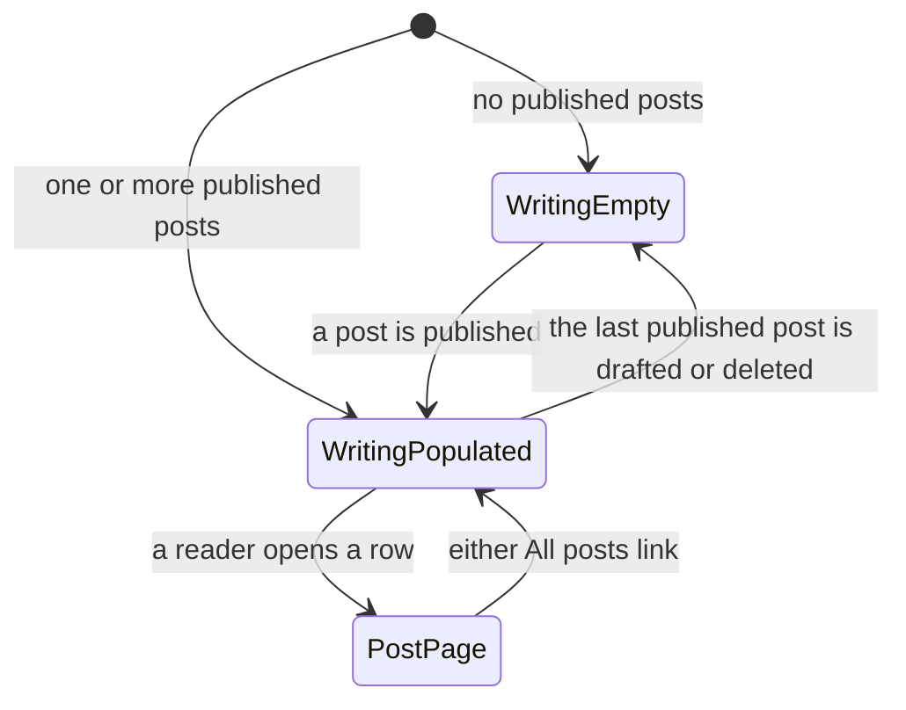

# Functional Specification — U2 Blog

The post half of the site, deepened from the skeleton U1 left. This file is the
source of truth for **U2's workflows and screen-state transitions**. It carries no
entity model and no business-rule block: U2 is a `ui` unit, and the `Post` entity
and every rule it obeys were authored once by U1 and are not redefined here.

Where this unit needs a rule that does not yet exist, it states it as a new rule
in § New rules this unit adds, numbered in U1's `BR` sequence so the two files
read as one rule set rather than two.

## Sources

- [upstream] `inception/units-generation/unit-of-work.md` § U2 — the boundary:
  the Writing list, the post page, post field rules and ordering, the feed, and
  build-time code colouring
- [upstream] `inception/units-generation/unit-of-work-story-map.md` § U2 — the
  ten requirements assigned to this unit and the recommended order within it,
  plus the cross-cutting rows recording what U1 built minimally and U2 completes
- [upstream] `inception/requirements-analysis/requirements.md` — FR2.1 to FR2.9,
  FR5.1, NFR2, NFR7, NFR12
- [upstream] `inception/domain-design/components.md` — `PostCatalog`,
  `MarkupRenderer`, `ContentTransforms` and `PageRenderer`, whose post-facing
  parts this unit owns
- [upstream] `construction/u1-publishable-site-shell/functional-design/` —
  `entities.md` (the `Post` entity) and `rules.md` (BR1.x, BR2.x, BR4.x, BR5.x),
  which this unit consumes rather than restates
- [Q1], [Q2] `functional-design-questions.md`

The declared `contract-summary` input is absent: Contract Design is SKIP in this
scope, because one build produces one deployable and no inter-unit API exists.

---

## Workflows

### W1 — Render the Writing list

| # | Step | Owner |
|---|---|---|
| 1 | Take the ordered post list — date descending, ties by slug (U1 BR2.4) | PostCatalog |
| 2 | If it is empty, render the empty state and stop | PageRenderer |
| 3 | For each post, render one row carrying title, date and summary | PageRenderer |
| 4 | Wrap the whole row in a single link to the post page | PageRenderer |
| 5 | Format the displayed date for reading | ContentTransforms |

Step 4 is the requirement rather than a styling choice: the row is **one** link
target covering all three values, so clicking the summary line opens the post
(FR2.3). It is also what makes the 44px phone target a property of one element
rather than three (NFR7).

### W2 — Render a post page

| # | Step | Owner |
|---|---|---|
| 1 | Render the post header: title, date, summary | PageRenderer |
| 2 | Render an "All posts" link above the body | PageRenderer |
| 3 | Render the Markdown body to HTML | MarkupRenderer |
| 4 | Colour every fenced code block during step 3 | MarkupRenderer |
| 5 | Render a second "All posts" link after the body | PageRenderer |

Both links in steps 2 and 5 are required (FR2.8, and BR8.4 below states it as a
rule) and both reach the Writing list. The second one exists because a long post
leaves the first one far off screen.

### W3 — Render a Markdown body

| # | Step | Behaviour |
|---|---|---|
| 1 | Headings, links, lists, images with alt text, and fenced code blocks all render | FR2.6 |
| 2 | An image's alt attribute passes through unchanged; nothing inspects it (BR8.1) | — |
| 3 | An unlabelled code fence renders as a plain code block, silently | [Q2] |
| 4 | A labelled fence whose language the highlighter knows is coloured at build time | FR2.7 |
| 5 | A labelled fence naming an unknown language fails the build, naming file and language | [Q2] |
| 6 | Colouring emits at most four token classes, none reusing the link accent | `interaction-spec.md` § Code Block |

Nothing in this sequence runs in the reader's browser. That is what keeps FR2.7
compatible with NFR2 and with the `script-src 'none'` policy U1 emits.

### W4 — Construct the feed

| # | Step | Owner |
|---|---|---|
| 1 | Take the ordered post list | PostCatalog |
| 2 | Build one entry per post: title, canonical link, declared date, one-line summary | ContentTransforms |
| 3 | Set each entry's identifier to the post's canonical URL | ContentTransforms |
| 4 | Return the feed document as text | ContentTransforms |
| 5 | Write it to the output and record it in the build manifest | SiteBuilder |

**The feed carries summaries, not bodies** ([Q1]). An entry is title, link, date
and the one-line summary the post already declares; the body stays on the site.

**Drafts are absent by construction, not by a second rule.** The ordered post list
never contains a draft (U1 BR1.7), so step 1 cannot put one in the feed. FR5.1's
"no draft" requirement needs no separate check, which is the point of excluding
drafts once at the boundary.

### W5 — The Writing page with nothing published

| # | Step | Behaviour |
|---|---|---|
| 1 | The ordered post list is empty | — |
| 2 | Keep the page heading and its rule | FR2.9 |
| 3 | Render one plain sentence — "Nothing published yet." | `mockups.md` § Home |
| 4 | Render a link to Projects | FR2.9 |

This is U1 BR5.5 applied to this unit's page; it is listed as a workflow because
it is a screen state a reader can actually reach, not a branch to note in passing.

---

## Screen-state transitions



<!-- Text fallback: the Writing page has two states, empty and populated, and
moves between them as posts are published or withdrawn. From the populated state
a reader opens a post page, and either All posts link returns them. There is no
loading state and no error state: pages are served complete. -->

**No loading state and no error state exist for this unit, and that is not an
omission.** Pages are served complete with nothing assembled in the browser
(NFR2), so there is no interval during which a reader sees a partial page. A
post that failed validation was never published at all — the build wrote nothing
(U1 BR4.4) — so there is no broken-post state for a reader to land in.

---

## New rules this unit adds

Four rules that U1 had no reason to state, numbered in the same sequence so the
two rule sets read as one.

```yaml
rules:
  - id: BR8.1
    statement: >
      Every non-decorative image in a post body carries descriptive alt text, and
      a decorative one carries an explicitly empty alt. This is an authoring
      rule, and the build does not enforce it.
    category: policy
    applies_to: The author, at write time
    trigger: Writing a post that contains an image.
    logic: >
      The rendering path passes an image's alt attribute through unchanged,
      whether it is descriptive, explicitly empty, or absent. No build step
      inspects it and no check fails on it.
    on_violation: >
      Nothing in this system detects it. That is the settled position rather
      than an oversight: `refined-mockups/accessibility-checklist.md` records
      alt text as priority P1, owned by the author per post, and states plainly
      that "the build does not require it". An earlier draft of this rule made a
      missing alt a build failure, which would have reversed that decision
      silently inside a Construction artifact — the wrong place to change an
      approved accessibility position.
      The honest cost: the automated accessibility scan was offered and declined
      at Practices Discovery, so a missing alt is now caught by nothing at all —
      not a scan, not the build, and not the keyboard walkthrough, which covers
      focus and tab order rather than image alternatives. If the team wants it
      enforced, that is a change to the checklist row first and to this rule
      second.
    source: FR2.6, accessibility-checklist.md § Image alt text (P1)

  - id: BR8.2
    statement: >
      A code fence naming a language the highlighter has no grammar for fails the
      build; an unlabelled fence renders plain and silently.
    category: validation
    applies_to: MarkupRenderer
    trigger: Rendering a fenced code block.
    logic: >
      IF the fence carries no language label THEN render a plain code block and
      report nothing.
      IF it carries a label the highlighter knows THEN colour it at build time.
      IF it carries a label the highlighter does not know THEN raise a field
      error naming the file and the language.
    on_violation: >
      Field error; build fails. The split is deliberate: an unlabelled fence is a
      choice, a misspelled label is always a mistake, and one rule covering both
      would get one of them wrong.
    known_language_resolution: >
      "A language the highlighter knows" is resolved in one of two ways, and the
      rule is implementable under either — the choice belongs to Code Generation
      and does not reopen this rule.
      PRIMARY: ask the highlighter for the set of languages it has grammars for,
      and treat a label outside that set as unknown.
      FALLBACK, used when the chosen highlighter exposes no such query and
      silently passes unrecognised labels through: declare the accepted label set
      explicitly in site configuration, and treat a label outside that declared
      set as unknown. The declared set is then the authority, and adding a
      language to a post means adding its label to that list first.
      The fallback is what keeps BR8.2 buildable against any highlighter; without
      it the rule would depend on a library capability nobody has chosen yet.
    source: FR2.6, FR2.7, "[Q2]"

  - id: BR8.4
    statement: >
      Every post page carries an "All posts" link above the body and a second one
      after it, and both reach the Writing list.
    category: policy
    applies_to: PageRenderer
    trigger: Rendering a post page.
    logic: >
      Emit exactly two "All posts" links per post page, one before the rendered
      body and one after it, both targeting the Writing list. Neither is
      conditional on the post's length.
    on_violation: >
      Emitting one link leaves a reader at the end of a long post with no route
      back except scrolling or the browser's own controls. The second link is the
      requirement, not a convenience: FR2.8 names both positions explicitly.
    source: FR2.8

  - id: BR8.3
    statement: >
      Each feed entry carries the post's title, canonical link, declared date and
      one-line summary, and is identified by its canonical URL.
    category: policy
    applies_to: ContentTransforms
    trigger: Constructing the feed.
    logic: >
      Emit an Atom feed. Each entry's identifier is the post's canonical URL,
      built from `SiteMetadata.baseUrl`; its content is the post's `summary` and
      not its body.
    on_violation: >
      Carrying the body would let a reader consume the whole site inside a feed
      reader, and requires rendered HTML to be escaped into the feed correctly —
      a recurring source of silent breakage that nothing in this unit's check set
      would detect.
    source: FR5.1, "[Q1]"

  - id: BR8.5
    statement: >
      The Writing page lists every published post exactly once, and each row
      shows the post's title, one-line summary and declared date.
    category: policy
    applies_to: PageRenderer
    trigger: Rendering the Writing page.
    logic: >
      Take every post `PostCatalog` yields — which is every non-draft post, drafts
      having already been withheld by BR1.7 — and emit one row per post, in the
      order BR2.4 fixes. Each row carries exactly three values: `title`, the
      one-line summary, and the declared front-matter `date`. No post appears
      twice, and none is omitted.
    on_violation: >
      A row missing one of the three values, or a post silently absent from the
      list, is the failure mode this project's check set exists to catch: FR2.1
      is the requirement, and check 2 of the pre-push set (every content file
      produced a page) would see an absent PAGE but not an absent ROW. Nothing
      else states the row's content, so without this rule FR2.1 has no rule
      behind it at all.
    source: FR2.1

  - id: BR8.6
    statement: >
      Each Writing list row is a single link target covering the whole row.
    category: policy
    applies_to: PageRenderer
    trigger: Rendering a Writing list row.
    logic: >
      Wrap the entire row — title, summary and date together — in one link to the
      post page, as workflow W1 step 4 specifies. A click or tap anywhere in the
      row, including on the summary line, opens the post. The row carries exactly
      one target; it is not split into a linked title beside unlinked metadata.
    on_violation: >
      A row whose summary line is not part of the link fails FR2.3's acceptance
      criterion directly, and it fails NFR7's 44px floor by shrinking the hit area
      to the title line. It also makes this a single-target row, which is the
      shape NFR6 assumes when it says a list row keeps one hit target with the
      date moving beneath the title at phone width — the unit that owns styling
      is where that contraction behaviour is specified, not here.
    source: FR2.3

  - id: BR8.7
    statement: >
      A post page carries the post's title, one-line summary, declared date and
      rendered body.
    category: policy
    applies_to: PageRenderer
    trigger: Rendering a post page.
    logic: >
      Emit all four values on every post page. The first three come from the
      front matter U1's BR2.1-BR2.3 require; the fourth is the body as
      `MarkupRenderer` rendered it. All four are present on every post page, with
      no conditional omission.
    on_violation: >
      U1's BR2.1-BR2.3 guarantee the three fields EXIST in the source file and
      fail the build when they do not; they say nothing about the page rendering
      them. A post page could satisfy every one of those rules and still omit the
      date. FR2.4 is about the page, so it needs a rule about the page.
    source: FR2.4
```

| ID | Rule | Category | Enforced by |
|---|---|---|---|
| BR8.1 | Post images carry alt text — an authoring rule the build does not check | policy | The author, at write time |
| BR8.2 | Unknown fence language fails; unlabelled fence renders plain | validation | MarkupRenderer |
| BR8.3 | Feed entries carry summary and canonical-URL identity, not bodies | policy | ContentTransforms |
| BR8.4 | Two "All posts" links per post page, above and after the body | policy | PageRenderer |
| BR8.5 | The Writing page lists every post once, each row showing title, summary and date | policy | PageRenderer |
| BR8.6 | The whole Writing row is one link target | policy | PageRenderer |
| BR8.7 | A post page carries title, summary, date and body | policy | PageRenderer |

**Only one of these seven fails a build when broken.** Worth stating precisely,
because "the build catches it" is the assumption that makes a rule feel safer
than it is:

| Rule | What actually catches a violation |
|---|---|
| BR8.1 | Nobody. An authoring rule with no enforcement point in software, written that way deliberately — see its `on_violation` note |
| BR8.2 | **The build**, which fails naming the file and the fence |
| BR8.3 | Nothing automated. A malformed feed is found by opening it in a reader |
| BR8.4 | Partly the internal-link check, which would see a link that resolves nowhere — but not a link that was never emitted |
| BR8.5 | Nothing automated. Check 2 of the pre-push set sees an absent *page*, never an absent *row* |
| BR8.6 | Nothing automated. The keyboard walkthrough, where a row that is not one target shows up as two tab stops |
| BR8.7 | Nothing automated. Reading a post page |

The three rules added for FR2.1, FR2.3 and FR2.4 are rendering rules, and this
project has no rendering check — that is the honest position, not a gap this
unit can close.

---

## What this unit completes from U1

The story map's cross-cutting table names the requirements U1 touched and U2
finishes. Stated here so a Build and Test run can tell "shallow on purpose" from
"unfinished":

| ID | U1 built | U2 completes |
|---|---|---|
| FR2.4 | One minimal post page, to satisfy the skeleton's first condition | The full post page: header, both "All posts" links, complete body |
| FR2.6 | Enough Markdown rendering to serve that page | Headings, links, lists, images with alt text, code blocks — the full set |
| FR2.7 | Build-time colouring in principle | The four-token theme and BR8.2's language handling |

**FR4.3 is deliberately not a row in that table, and this is what it is
instead.** `unit-of-work-story-map.md` § Cross-cutting does name U2 against
FR4.3, as "filling the recent-posts section with real entries" — but it names
**U1 as the owner**, and ownership is what the table above is about. Recording
FR4.3 as something U2 *completes* would put the same requirement in two units'
completion tables and leave it implementable from neither.

So it is recorded here as an **incidental effect**: publishing posts is what
makes the ordered post list non-empty, so Home's recent-posts section stops
showing its empty state once this unit's work exists to feed it. That is the
ordinary consequence of U1's BR5.3 reading a list this unit fills, not a piece of
FR4.3 that U1 left unfinished.

**U1 owns FR4.3, and U1 is where it is settled.** U1's BR5.3 states how the
section fills — the first 3 of the ordered post list (BR2.4), every item it has
when fewer than 3 exist, and the empty state (BR5.5) when none do — and U1's
`traceability.json` is where FR4.3 is claimed. Nothing in this unit implements,
completes, or may redefine it, and no rule here governs Home.

---

## Assumptions & Open Questions

| ID | Assumption | Invalidated by |
|---|---|---|
| U2A1 | The highlighter can be asked which languages it knows, so BR8.2's "unknown language" test can be answered directly. | A highlighter that silently passes unknown labels through. This no longer threatens BR8.2: the rule states an explicit fallback — an accepted-label set declared in site configuration — so the assumption failing changes which mechanism resolves "known", not whether the rule can be built. |
| U2A2 | A post's one-line summary is suitable as its feed entry content without rewriting. It already serves as the list-row summary and the page description (U1 BR5.8), so a third use adds no new authoring burden. | Feed readers rendering summaries in a way that makes a single line read badly, which is an observation, not something this stage can check. |
| U2A3 | The feed lives at a single fixed path, and that path never changes once published. NFR8 governs page slugs and says nothing about the feed, but a moved feed URL silently unsubscribes every reader. | A decision to version or relocate the feed, which should be treated as an NFR8-class change rather than a routine one. |

| ID | Open question | Who closes it |
|---|---|---|
| U2OQ1 | What does a feed reader show when a slug is deleted and later reused by a different post? Entry identity is the canonical URL (BR8.3), so the new post inherits the old entry's identity and a subscriber may see the old title against new content. | Not closable here — it depends on U1's FA1, which records that deletion behaviour is undecided. Carried to Build and Test with FA1 rather than resolved by inventing a tombstone. |
