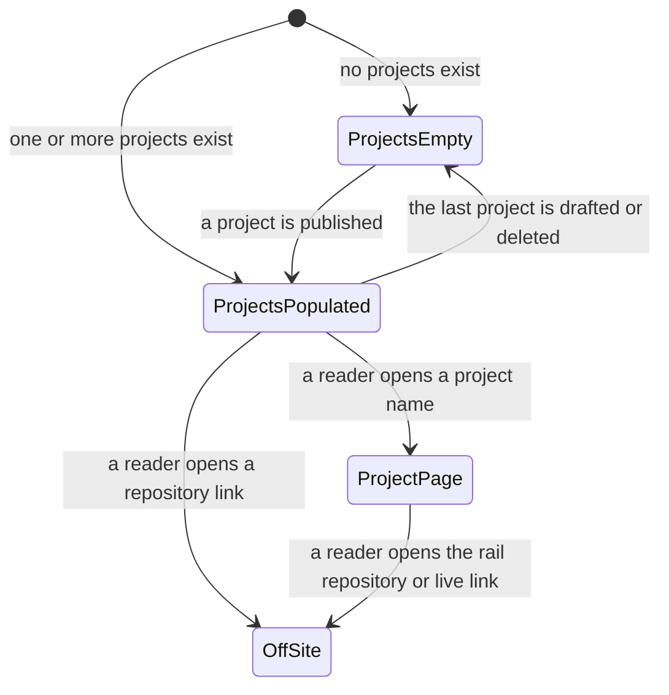

# Functional Specification — U3 Projects

The projects half of the site, deepened from the skeleton U1 left. This file is
the source of truth for **U3's workflows and screen-state transitions**. It
carries no entity model and no base rule block: U3 is a `ui` unit, and the
`Project` entity and the rules it obeys were authored once by U1.

Where this unit needs a rule that does not yet exist, it states it in § New rules
this unit adds, numbered in U1's `BR` sequence so the construction record reads as
one rule set rather than several.

## Sources

- [upstream] `inception/units-generation/unit-of-work.md` § U3 — the boundary:
  the Projects list, the write-up page and its metadata rail, and
  project-specific field rules. It also flags project ordering as this unit's to
  settle.
- [upstream] `inception/units-generation/unit-of-work-story-map.md` § U3 — the
  seven requirements assigned here and the recommended order within the unit,
  plus the cross-cutting row recording that U1 served one project page minimally
- [upstream] `inception/requirements-analysis/requirements.md` — FR3.1 to FR3.7,
  NFR1, NFR6, NFR7, NFR11
- [upstream] `inception/domain-design/components.md` — `ProjectCatalog` and the
  project-facing parts of `PageRenderer`, which this unit owns
- [upstream] `construction/u1-publishable-site-shell/functional-design/` —
  `entities.md` (the `Project` entity, including the optional `liveUrl` and
  `featured`) and `rules.md` (BR1.x, BR3.x, BR4.x, BR5.x)
- [upstream] `inception/refined-mockups/mockups.md` and `interaction-spec.md` —
  the Projects and Project page shapes and the metadata rail
- [Q1] `functional-design-questions.md`

The declared `contract-summary` input is absent: Contract Design is SKIP in this
scope, because one build produces one deployable and no inter-unit API exists.

---

## Workflows

### W1 — Render the Projects list

| # | Step | Owner |
|---|---|---|
| 1 | Take the ordered project list — featured first, then year descending, then slug (U1 BR3.7) | ProjectCatalog |
| 2 | If it is empty, render the empty state and stop | PageRenderer |
| 3 | For each project, render a row carrying name, summary, tools and a repository link | PageRenderer |
| 4 | Make the project name and the repository link two separate, visibly distinguishable targets | PageRenderer |
| 5 | Give the repository link an accessible name identifying its project | PageRenderer |
| 6 | Mark the repository link as leading off this site | PageRenderer |

**Step 4 is where this unit differs from the blog, and the difference is
deliberate.** A Writing row is a single link covering everything in it; a
Projects row carries two destinations — the write-up on this site and the
repository elsewhere — so it must have two targets (FR3.5). Collapsing them into
one would make either the repository unreachable from the list or the write-up
unreachable.

**Step 5 is the requirement, not a nicety.** Read out of context, a list of links
all named "repo" tells a screen-reader user nothing about which project each one
belongs to (FR3.6).

### W2 — Render a project write-up page

| # | Step | Owner |
|---|---|---|
| 1 | Render the project header: name and summary | PageRenderer |
| 2 | Render the metadata rail beside the body | PageRenderer |
| 3 | Emit the rail rows in fixed order: year, type, tools, repository, live URL | PageRenderer |
| 4 | Omit the live-URL row entirely when the project declares none (U1 BR3.5) | PageRenderer |
| 5 | Render the Markdown body, of author-chosen structure and length | MarkupRenderer |

Step 3's order is fixed by this unit (new rule BR9.1) so the rail reads the same
on every project page. Step 4 omits the whole row — label included — rather than
rendering a label with nothing after it.

### W3 — The Projects page with nothing to list

| # | Step | Behaviour |
|---|---|---|
| 1 | The ordered project list is empty | — |
| 2 | Keep the page heading and its rule | FR3.7 |
| 3 | Render one plain sentence — "Nothing here yet." | `mockups.md` § Home |
| 4 | Render a link to Writing | FR3.7 |

This is U1 BR5.5 applied to this unit's page. Note what it is **not**: it is not
reachable while any project exists, because ordering is total rather than
filtered (U1 BR3.7). The only way to see it is to have no projects at all.

### W4 — A reader follows a repository link

| # | Step | Behaviour |
|---|---|---|
| 1 | The reader activates a repository link, from a list row or a rail | — |
| 2 | They leave this site for the repository host | — |
| 3 | Nothing is checked, recorded, or reported about the destination | NFR11 |

Written as a workflow because of what it forecloses. The link's shape was
validated at build time (U1 BR3.4) and its reachability never is: a repository
that has been renamed or made private produces a dead link that this site's check
set will not catch, deliberately, because failing the build on somebody else's
outage would stop this site publishing.

---

## Screen-state transitions



<!-- Text fallback: the Projects page has two states, empty and populated. From
the populated state a reader either opens a project write-up page or leaves the
site by a repository link. From a write-up page they can also leave by the rail's
repository or live link. There is no loading state and no error state: pages are
served complete. -->

**No loading state and no error state, and that is not an omission.** Pages are
served complete with nothing assembled in the browser (NFR2). A project that
failed validation was never published — the build wrote nothing (U1 BR4.4) — so
there is no broken-project state a reader can land in.

---

## New rules this unit adds

```yaml
rules:
  - id: BR9.1
    statement: >
      The metadata rail emits its rows in one fixed order — year, type, tools,
      repository, live URL — on every project page.
    category: policy
    applies_to: PageRenderer
    trigger: Rendering a project write-up page.
    logic: >
      Emit the rows in that order. A row whose value is absent is omitted
      entirely rather than reordering the rows that remain; only `liveUrl` can be
      absent (U1 BR3.5), because every other rail value is a required field.
    on_violation: >
      A rail whose row order varies by project makes the reader re-read it each
      time. Nothing automated would catch it, which is why it is stated as a rule
      rather than left to each template.
    source: FR3.2

  - id: BR9.2
    statement: >
      A Projects list row carries exactly two targets: the project name, linking
      the write-up on this site, and the repository link, leading off it.
    category: policy
    applies_to: PageRenderer
    trigger: Rendering a Projects list row.
    logic: >
      Emit the name and the repository link as separate, visibly distinguishable
      targets. The repository link carries an outbound affordance and an
      accessible name identifying its project — never a bare "repo". The row's
      summary and tools are not links.
    on_violation: >
      One target makes either the write-up or the repository unreachable from the
      list. A bare "repo" accessible name leaves a screen-reader user with a list
      of identical link names.
    relation_to_nfr6: >
      NFR6 says list rows "keep one hit target with the date moving beneath the
      title" at phone width, and its Verify line applies to each page type. Read
      unqualified, that clause and this rule contradict each other. They do not,
      and the reconciliation is stated here rather than left to whoever happens to
      read both.
      NFR6's clause DESCRIBES A CONTRACTION, and it describes it for rows whose
      desktop form is already a single target — post rows, on Writing and in
      Home's recent-posts section. Its own wording gives that away: a row with a
      date moving beneath its title is a post row, because a Projects row carries
      no date. What the clause forbids is a single-target row SPLITTING into two
      on contraction, handing a reader a target the design never had.
      A PROJECTS ROW IS THE DELIBERATE EXCEPTION, and it is an exception at the
      REQUIREMENT level, not a design liberty taken here: FR3.5 requires the
      project name and the repository link to be "separately and visibly
      distinguishable targets" in each Projects list row. Two targets at every
      width is what FR3.5 asks for, so a Projects row neither has one target to
      keep nor gains one under contraction — NFR6's clause has nothing to
      constrain in it.
      U5's BR11.6 is the scoped statement of NFR6 and carries the same exception
      explicitly, and U5's BR11.1 sizes the outbound link to its own 44px target
      below the breakpoint while the 16px clear space holds between the two hit
      areas. Nothing in NFR6 or BR11.6 may be read as instructing anyone to merge
      or remove the second target.
    source: FR3.1, FR3.5, FR3.6

  - id: BR9.3
    statement: >
      The Projects page uses the same total project order as Home.
    category: calculation
    applies_to: ProjectCatalog
    trigger: Rendering the Projects list.
    logic: >
      Order by `featured` true first, then `year` descending, then `slug`
      ascending — exactly U1 BR3.7, applied to the full list rather than its top
      three. There is one project order on this site, not two.
    on_violation: >
      Two orderings for one collection is the kind of divergence nobody
      remembers: marking a project featured would move it on Home and not on the
      page that lists everything.
      The accepted cost, stated because it is real: `featured` now reorders the
      full Projects page too, which an author who meant "show this on Home" may
      not expect.
    source: FR3.1, "[Q1]"

  - id: BR9.4
    statement: >
      The Projects page lists every project exactly once, and each row shows the
      project's name, one-line summary, tools and a repository link.
    category: policy
    applies_to: PageRenderer
    trigger: Rendering the Projects page.
    logic: >
      Take every project `ProjectCatalog` yields, in the order BR9.3 fixes, and
      emit one row per project. Each row carries exactly four values: `name`, the
      one-line summary, `tools`, and a link to `repo`. No project appears twice,
      and none is omitted.
      `repo` is one of the six fields U1's BR3.1-BR3.4 require, so it is always
      present — unlike `liveUrl`, whose absence BR9.1 handles by omitting a rail
      row. There is no omit case here.
    on_violation: >
      BR9.2 establishes the SHAPE of a row (two targets, the second named for its
      project) and BR9.3 establishes its ORDER. Neither says what a row contains,
      so without this rule a row carrying only a name would satisfy every other
      rule this unit has while failing FR3.1's acceptance test outright ("every
      project appears once with all four").
      Nothing automated catches it: the pre-push check set sees pages, not row
      contents.
    source: FR3.1

  - id: BR9.5
    statement: >
      A project write-up page carries the metadata rail beside a body, and the
      rail carries year, type, tools, repository and live URL.
    category: policy
    applies_to: PageRenderer
    trigger: Rendering a project page.
    logic: >
      Emit the rail as a sibling of the body, carrying five rows in the fixed
      order BR9.1 sets: year, type, tools, repository, live URL. The body renders
      the project's authored content at whatever structure and length the author
      chose, with no imposed section set and no length constraint.
      The live-URL row is the one optional member: BR9.1 omits it entirely when
      `liveUrl` is absent, leaving a four-row rail rather than an empty fifth row.
    on_violation: >
      BR9.1 establishes only the rail's row ORDER and its omit-when-absent
      behaviour — it presupposes a rail that already exists and already carries
      those rows. Without this rule, FR3.2's commitment that the page carries a
      rail beside a body, and that the body is author-chosen rather than
      templated, rests on nothing a developer can be checked against.
      Nothing automated catches it.
    source: FR3.2
```

| ID | Rule | Category | Enforced by |
|---|---|---|---|
| BR9.1 | The rail's row order is fixed; an absent row is omitted, not reordered | policy | PageRenderer |
| BR9.2 | A list row carries exactly two targets, the second named for its project — the requirement-level exception to NFR6's one-hit-target clause, per FR3.5 | policy | PageRenderer |
| BR9.3 | The Projects page uses the same total order as Home | calculation | ProjectCatalog |
| BR9.4 | Every project appears once; each row shows name, summary, tools and a repo link | policy | PageRenderer |
| BR9.5 | A project page carries the five-row rail beside an author-chosen body | policy | PageRenderer |

**BR9.1, BR9.2, BR9.4 and BR9.5 are caught by no automated check.** They are template
properties — the rail's row order and the two-target row shape — and the pre-push
check set covers the build, page coverage and internal links, none of which
inspects either. A keyboard walkthrough and a design review are what verify them.

**BR9.3 is different, and stating otherwise would mislead a developer.** It is an
ordering rule, and ordering is a data transformation: `team.md` § Testing Posture
names "post sorting" as exactly the class of function that requires a unit test,
and this unit's `frontend-components.md` § Props and branches already records
that `ProjectCatalog`'s ordering "is one of the functions with a unit test behind
it". So BR9.3 is covered by that unit test, verified at Build and Test against
the coverage floor, and a regression in it fails a test rather than waiting for
someone to notice the Projects page is in the wrong order.

The distinction matters because a developer reading only this file would
otherwise skip writing the test that `frontend-components.md` and the affirmed
testing posture both call for.

**Sizing the second target is not this unit's to state, and is no longer open.**
BR9.2 introduces the two-target row, so the question of how the outbound
repository link reaches the 44px floor at phone width (NFR7) arises here — but
U5 owns styling, and `interaction-spec.md` § Outbound Link sizes only the clear
space between the two targets, not the height of either. It is settled in U5 as
**BR11.1**, a single minimum-target rule applied to every standalone link below
the breakpoint, with the clear space measured between the enlarged hit areas
rather than the glyph boxes so the 16px anti-mis-hit gap is preserved rather than
consumed. U5's `BR11.6` is explicitly scoped so that its "a row does not gain a
hit target on contraction" clause does not reach Projects rows: two targets here
are the design, not a contraction artefact.

**The requirement behind that scoping is FR3.5, not a Construction-stage
judgement.** NFR6's clause — "list rows keep one hit target with the date moving
beneath the title", verified per page type — describes rows whose desktop form is
already single-target: post rows, which carry a date. A Projects row carries no
date, and FR3.5 requires its project name and its repository link to be
separately and visibly distinguishable targets, so it has two targets at every
width *by requirement*. That makes a Projects row the deliberate,
requirement-level exception to NFR6's one-hit-target clause rather than a row
that breaks it. BR9.2's `relation_to_nfr6` states the reconciliation in full, and U5's BR11.6
carries the matching statement on the styling side, so neither text has to be
reconciled against the other by whoever happens to read both.

---

## What this unit completes from U1

| ID | U1 built | U3 completes |
|---|---|---|
| FR3.2 | One minimal project page and rail, for the skeleton's first condition | The full write-up page, the fixed rail order, and the omit behaviour in context |

**FR4.3 is deliberately not a row in that table, and this is what it is
instead.** `unit-of-work-story-map.md` § Cross-cutting does name U3 against
FR4.3, as "filling the selected-projects section with real entries" — but it
names **U1 as the owner**, and ownership is what the table above is about.
Recording FR4.3 as something U3 *completes* would put the same requirement in two
units' completion tables and leave it implementable from neither.

So it is recorded here as an **incidental effect**: this unit builds the Projects
page and the write-up page, and it reads the same ordered project list Home's top
three are taken from — BR9.3 exists precisely so there is one project order on
this site rather than two. Projects existing is what makes that list non-empty,
so Home's projects section fills as this unit's work lands.

**U1 owns FR4.3, and U1 is where it is settled.** U1's BR5.3 states how the
section fills — the first 3 of the ordered project list (U1 BR3.7), every project
it has when fewer than 3 exist, and the empty state (BR5.5) only when no project
exists at all — and U1's `traceability.json` is where FR4.3 is claimed. Because
BR3.7 orders rather than selects, no `featured` value can empty that section
while projects exist. Nothing here implements, completes, or may redefine FR4.3,
and no rule in this unit governs Home.

---

## Assumptions & Open Questions

| ID | Assumption | Invalidated by |
|---|---|---|
| U3A1 | A project's one-line summary serves the list row and the page description without rewriting, as a post's does (U1 BR5.8). | A summary that reads well in a row but badly as a shared-link preview — an observation, not something this stage can check. |
| U3A2 | The rail's five rows fit a single column at phone width without truncation, given that `tools` is a list. A long tools list wraps rather than overflowing. | A tools list long enough to dominate the phone layout, which is a U5 styling observation rather than a design fault here. |
| U3A3 | `type` needs no controlled vocabulary. U1 left it free text and no requirement asks the Projects page to group or filter by it. | A later decision to group the list by type, which would need a vocabulary that does not exist and would reopen U1's `Project.type` constraint. |

| ID | Open question | Who closes it |
|---|---|---|
| U3OQ1 | Nothing detects a repository link that has gone dead — renamed, made private, or deleted. NFR11 forbids checking external links on the publish path, and the scheduled weekly external-link check recommended at Practices Discovery was left out of this version. | Not closable here: it is a deliberate exclusion, not a gap. If the team wants it, `team-practices.md` already records the shape — a scheduled check, never a publish gate. |
