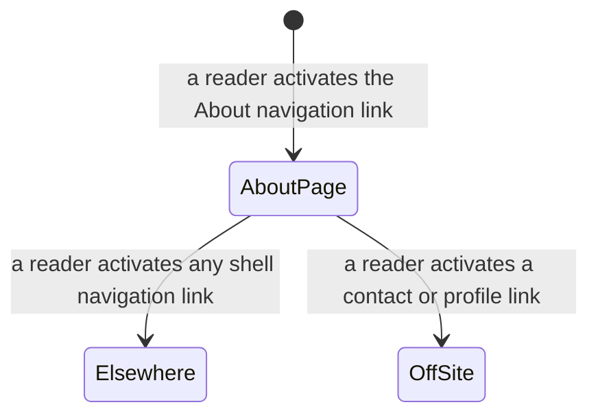

# Functional Specification — U4 About Page

The About page: one page type, at its own URL, carrying who the author is and
contact or profile links. This file is the source of truth for **U4's workflows
and screen-state transitions**. It carries no entity model and no base rule
block: U4 is a `ui` unit, and the content model and its rules were authored once
by U1.

This is the smallest unit in the set, and `unit-of-work.md` warns that its main
risk is being treated as trivial and skipping its keyboard walkthrough. This
specification is short because the unit is small, not because it was hurried.

## Sources

- [upstream] `inception/units-generation/unit-of-work.md` § U4 — the boundary:
  the About page at its own URL, reachable in one click from Home, and the
  warning above
- [upstream] `inception/units-generation/unit-of-work-story-map.md` § U4 — the
  single requirement assigned to this unit, FR4.1
- [upstream] `inception/requirements-analysis/requirements.md` — FR4.1, FR4.5,
  NFR1, NFR2, NFR6; and the note that FR4.1 resolved a contradiction the
  wireframes carried, in favour of a page rather than prose inline on Home
- [upstream] `inception/domain-design/components.md` — `PageRenderer`, which owns
  every page template including this one
- [upstream] `construction/u1-publishable-site-shell/functional-design/` —
  `entities.md` (`ContentFile.kind` is exactly post and project, which is what
  made [Q1] necessary) and `rules.md` (BR1.1, BR5.1, BR5.2, BR5.7, BR5.8–BR5.10,
  and BR7.1, which W3 step 4 cites for the publish trigger)
- [upstream] `inception/practices-discovery/team-practices.md` — § Way of Working
  (the branch path versus the direct-to-`main` content path, split by what the
  commit contains) and § Code Style (the formatter formats site code and never
  the text of a post), both cited below
- [upstream] `inception/refined-mockups/mockups.md` — the technical register this
  page renders in
- [Q1] `functional-design-questions.md`

The declared `contract-summary` input is absent: Contract Design is SKIP in this
scope, because one build produces one deployable and no inter-unit API exists.

---

## Workflows

### W1 — Render the About page

| # | Step | Owner |
|---|---|---|
| 1 | Render the global shell, with About marked as the current page | PageRenderer |
| 2 | Emit the page's own head title and its hard-coded description | PageRenderer |
| 3 | Render the About prose, held in the template itself | PageRenderer |
| 4 | Render the contact or profile links | PageRenderer |

Step 3 is the whole of [Q1]'s answer: the prose is part of the template, not a
content file. `ContentSource` never sees it, `ContentFile.kind` gains no third
value, and the content walk is untouched.

Step 2 uses the per-template description U1 established (BR5.8), falling back to
the site-wide description only if this template ever supplies none — which it
should not, because a page about the author is exactly the page whose shared-link
preview matters.

### W2 — Reach About

| # | Step | Behaviour |
|---|---|---|
| 1 | The reader activates the About link in the shell's navigation | — |
| 2 | About loads, one click from wherever they were, Home included | FR4.5, U1 BR5.7 |

There is no other route to About and no other route is needed. It is not listed
on Home as a section, does not appear in either list page, and is not in the feed.

### W3 — Change what About says

| # | Step | Actor | Notes |
|---|---|---|---|
| 1 | Edit the prose in the About template | Author | It is site code, not content |
| 2 | Take the branch path, not the direct-to-`main` content path | Author | `inception/practices-discovery/team-practices.md` § Way of Working: the split is by what the commit contains |
| 3 | Run the three blocking checks before the push | Author | NFR9 |
| 4 | Merge to `main`; the push publishes | Author | U1 BR7.1 — a push to `main` is the only publish trigger |

**This is the cost of [Q1]'s answer, written down rather than discovered later.**
Changing a post is a content commit straight to `main`; changing About is a code
commit on a short-lived branch, and the formatter will reformat the prose because
formatters format site code. That is the accepted trade for keeping the content
model at two kinds.

---

## Screen-state transitions



<!-- Text fallback: a reader arrives at the About page from the shell's
navigation, and leaves it either by another navigation link or by following one
of the page's own contact or profile links off the site. There is no loading
state, no empty state, and no error state. -->

**Three states that other page types have and this one does not**, each marked
not applicable with its reason rather than invented to fill a slot:

| State | Why it cannot occur here |
|---|---|
| Loading | Pages are served complete, with nothing assembled in the reader's browser (NFR2) |
| Empty | The page's content is part of its template, so it cannot be absent the way a list can have no entries |
| Error | A page whose prose lives in a template cannot fail content validation; there is no content file to validate |

---

## New rules this unit adds

```yaml
rules:
  - id: BR10.1
    statement: >
      The About page's prose and links live in the About template, not in a
      content file, and `ContentFile.kind` remains exactly post and project.
    category: constraint
    applies_to: PageRenderer
    trigger: Rendering the About page; any future change to the content model.
    logic: >
      The About template holds its own prose. No third `kind` value is
      introduced, no `content/pages/` directory is created, and `ContentSource`
      never discovers About.
    on_violation: >
      Adding a third kind for one page grows the content model, the validation
      path, and the build's branching for a page that changes rarely. A generic
      "page" capability built for one current page is the kind of speculative
      generality the initiative's exclusions were written against.
      The accepted cost: About is edited as site code, on a branch, and the
      formatter rewrites its prose.
    source: FR4.1, "[Q1]"

  - id: BR10.2
    statement: >
      Every contact or profile link on the About page is an ordinary outbound
      link with an accessible name identifying its destination.
    category: policy
    applies_to: PageRenderer
    trigger: Rendering the About page's links.
    logic: >
      Emit each as a plain link carrying the outbound affordance, named for where
      it goes rather than by a bare label such as "profile" or "here". No icon is
      fetched from another server, and no embedded widget is used.
    on_violation: >
      An embedded profile widget would load from a third party, which the
      content-security policy forbids outright (U1 BR5.10) and which is the
      substance of the tracking this initiative excluded. A link named "here"
      leaves a screen-reader user with no idea of the destination.
    source: FR4.1, NFR3, NFR4

  - id: BR10.3
    statement: >
      The site serves an About page at `/about`, carrying prose identifying the
      author and at least one contact or profile link.
    category: policy
    applies_to: PageRenderer
    trigger: Building the site.
    logic: >
      Emit exactly one About page, at the path `/about`, on every build. It
      carries two things, both required: prose saying who the author is, and one
      or more contact or profile links. Neither is conditional and neither may be
      empty — a page with a heading and nothing beneath it does not satisfy this
      rule.
      The page is emitted unconditionally rather than derived from content, so
      there is no state in which it is absent: BR10.1 puts its prose in the
      template rather than in a content file precisely so that no missing or
      malformed content file can make it disappear.
    on_violation: >
      BR10.1 constrains WHERE the prose lives and BR10.2 constrains HOW each link
      is emitted. Both presuppose a page that already exists and already carries
      prose and links; neither establishes that it does. Without this rule,
      FR4.1's three commitments — the page exists at its own URL, it says who the
      author is, it carries contact links — have no rule behind them, and a build
      that emitted no About page at all would break no rule this unit states.
      Nothing automated catches it directly. Check 2 of the pre-push set matches
      output pages against content files, and About has no content file by
      design, so its absence would not register there either.
    source: FR4.1
```

| ID | Rule | Category | Enforced by |
|---|---|---|---|
| BR10.1 | About's prose lives in its template; the content model stays at two kinds | constraint | PageRenderer |
| BR10.2 | Contact and profile links are plain outbound links with real accessible names | policy | PageRenderer |
| BR10.3 | An About page is served at `/about`, carrying author prose and at least one contact link | policy | PageRenderer |

BR10.2's third-party half **is** automatically enforced — U1's content-security
policy breaks a page that loads an off-origin resource, visibly rather than
silently. Its accessible-name half is not: nothing checks link names, since the
automated accessibility scan was declined at Practices Discovery. The keyboard
walkthrough is what catches it, or nothing does.

---

## Assumptions & Open Questions

| ID | Assumption | Invalidated by |
|---|---|---|
| U4A1 | About changes rarely enough that editing a template rather than a Markdown file is the right trade. [Q1] chose on that basis. | About turning out to change like content — a few times a year rather than a few times ever — at which point a third `kind` earns its cost and BR10.1 should be revisited rather than worked around. |
| U4A2 | A formatter configured for site code reformatting About's prose is acceptable. `inception/practices-discovery/team-practices.md` § Code Style protects *post* prose from the formatter; About is not a post, so it falls outside that protection. | The author finding the reformatting disruptive, which would make a path-scoped formatter exclusion for this one template the cheap fix. |
| U4A3 | About needs no structural elements beyond prose and links — no image, no list of roles, no timeline. FR4.1 names only "who the author is, with contact or profile links". | A later wish for a photograph or richer structure, which would raise the asset question this unit currently does not have. |

| ID | Open question | Who closes it |
|---|---|---|
| U4OQ1 | None. FR4.1 is the single requirement, [Q1] settled the one structural gap, and nothing was handed to this unit unresolved. Stated explicitly rather than left as an empty heading. | — |
