# Functional Specification — U5 Visual Direction

The design system applied across every page type that now exists. This file is
the source of truth for **U5's workflows and state transitions**. It carries no
entity model and no base rule block: U5 is a `ui` unit, and the content model and
its rules were authored once by U1.

**This unit changes no behaviour and no content.** Its deliverable is the
treatment *applied*, which is why it depends on the page-type units rather than
the other way round: a treatment cannot be applied to, or verified against, pages
that do not exist.

## Sources

- [upstream] `inception/units-generation/unit-of-work.md` § U5 — the boundary:
  the design system implemented as a stylesheet and applied across every page
  type, plus the self-hosted font; and the four constraints listed there
- [upstream] `inception/units-generation/unit-of-work-story-map.md` § U5 — this
  unit delivers **no functional requirement** and carries five non-functional
  ones instead, which is why it is a Must Have rather than a polish pass
- [upstream] `inception/requirements-analysis/requirements.md` — NFR1, NFR3,
  NFR4, NFR6, NFR7; NFR5, which forbids introducing a numeric performance
  target; and FR3.5, which is not delivered by this unit but is what scopes
  NFR6's one-hit-target clause away from Projects rows (BR11.6)
- [upstream] `construction/u3-projects/functional-design/functional-spec.md` —
  BR9.2, the two-target Projects row this unit's BR11.6 must not contract away
- [upstream] `inception/domain-design/components.md` — `PageRenderer`, which owns
  the markup this unit styles and the head the font is preloaded in
- [upstream] `inception/refined-mockups/design-system-mapping.md` — every colour,
  type, spacing, border, radius, focus and motion token, and the measured
  contrast table
- [upstream] `inception/refined-mockups/mockups.md` — the two registers
- [upstream] `inception/refined-mockups/interaction-spec.md` — per-element states,
  content and responsive behaviour
- [upstream] `inception/refined-mockups/accessibility-checklist.md` — the
  keyboard walkthrough and what nothing checks
- [upstream] `construction/u1-publishable-site-shell/functional-design/rules.md` —
  BR5.2 (skip link position) and BR5.10 (the content-security policy this unit
  must keep holding)
- [Q1]–[Q3] `functional-design-questions.md`

The declared `contract-summary` input is absent: Contract Design is SKIP in this
scope, because one build produces one deployable and no inter-unit API exists.

---

## Workflows

### W1 — Apply the treatment

| # | Step | Owner |
|---|---|---|
| 1 | Declare every token from the design system in one place | Stylesheet |
| 2 | Copy the variable font file into this repository, Latin subset only | This unit |
| 3 | Preload the font in the page head and declare its metric-matched fallback stack | PageRenderer |
| 4 | Load the single stylesheet from this site's own origin on every page | PageRenderer |
| 5 | Set the register — editorial or technical — as one class on the page root | PageRenderer |
| 6 | Apply the focus ring to every focusable element, with no exceptions | Stylesheet |
| 7 | Apply the minimum-target rule to standalone links below the breakpoint | Stylesheet |
| 8 | Apply the single transition, and disable it under reduced-motion preference | Stylesheet |

Steps 3 and 4 are the two places this unit could break U1's content-security
policy, and neither does: both the font and the stylesheet are served from this
site's own origin, which is what `default-src 'self'` allows. Nothing is fetched
from anywhere else, and no style is inlined — `style-src 'self'` carries no
`'unsafe-inline'`, so a style attribute added later breaks visibly.

### W2 — Verify the treatment

| # | Step | Who | Notes |
|---|---|---|---|
| 1 | Run the keyboard walkthrough on all seven page types | Author | The second of the two required runs |
| 2 | Confirm the skip link is first and becomes visible on focus | Author | Its position is U1 BR5.2; its visibility is this unit's |
| 3 | Confirm every focusable element shows the focus ring | Author | NFR1 |
| 4 | Confirm tab order still matches visual order after styling | Author | Styling can reorder visually without touching markup |
| 5 | Confirm no element swallows focus | Author | NFR1 |
| 6 | Load every page type with the network panel open; confirm every request is same-origin | Author | NFR3 |
| 7 | Confirm no console policy violation and no broken rendering | Author | NFR4 |
| 8 | Measure a list row and a standalone link at phone width | Author | NFR7 |
| 9 | Re-read the measured contrast table against the colours actually shipped | Author | The only contrast verification that exists |

**Step 4 is the one this unit uniquely threatens.** Every other unit emits markup
in document order and inherits tab order for free. A stylesheet can move things
visually without touching the markup, so this is the first point in the project
where visual order and tab order can diverge.

**Step 9 has no automation behind it at all.** The automated accessibility scan
was offered at Practices Discovery and declined; the measured contrast table is
the whole verification, and any colour change re-opens it by hand.

### W3 — A reader loads a page before the font arrives

| # | Step | Behaviour |
|---|---|---|
| 1 | The page's markup and stylesheet arrive; the font has not | — |
| 2 | Text renders immediately in the metric-matched fallback | No blank text, no loading state (NFR2) |
| 3 | The font arrives and the text swaps to it | — |
| 4 | Reflow is small, because the fallback was chosen for metric proximity | [Q2] |
| 5 | If the font never arrives, the page stays in the fallback and remains fully readable | — |

Step 5 is the property that matters: a font failure degrades the page's
appearance and nothing else. Nothing is hidden waiting for it, which is what
would have turned a slow request into the loading state NFR2 forbids.

---

## State transitions

This unit introduces no page states. It introduces **element** states, all of
them already specified per element in `interaction-spec.md`, and one document
state of its own — whether the real font has arrived.

```mermaid
stateDiagram-v2
    [*] --> FallbackFont: markup and stylesheet render
    FallbackFont --> RealFont: the self-hosted font arrives
    FallbackFont --> [*]: the font never arrives; the page stays readable
    RealFont --> [*]
```



<!-- Text fallback: a page first renders in the metric-matched fallback font. If
the self-hosted font arrives it swaps to it; if it never arrives the page remains
in the fallback and is fully readable either way. There is no state in which text
is hidden. -->

**No loading, empty or error state is introduced by this unit**, and each absence
is inherited rather than newly argued: pages are served complete (NFR2), empty
states belong to the units whose lists can be empty, and a stylesheet that fails
to load leaves unstyled but readable markup rather than an error.

---

## New rules this unit adds

```yaml
rules:
  - id: BR11.1
    statement: >
      Every standalone single-line link clears a 44px hit area below the single
      breakpoint, through one shared rule rather than per-element figures.
    category: policy
    applies_to: Stylesheet
    trigger: Rendering at phone width.
    logic: >
      Below the breakpoint, apply vertical padding sufficient to bring any
      single-line link to a 44px hit area without changing its type size or
      colour. Above the breakpoint, standalone links keep their natural size.
      This covers the repository link in a Projects row, the contact links on
      About, and the "All posts" links on a post page — and anything added later,
      because the rule is written once against the element rather than per site
      feature.
    clear_space_interaction: >
      A clear-space figure between two targets is measured between their HIT
      AREAS, not between their glyph boxes. Where this rule enlarges a hit area,
      the surrounding spacing grows with it so the specified clear space still
      holds between the enlarged areas.
      This is the reconciliation the numbers need rather than a refinement of
      them. `interaction-spec.md` § Outbound Link § Responsive sizes 16px of
      clear space between the Projects-row outbound link and the row's main
      target, deliberately, so that neither is hit by accident. That link is set
      at the meta size, so reaching 44px through padding alone adds roughly 26px
      — more than the whole 16px buffer — and padding measured from the glyph box
      would consume the very protection the figure exists to provide.
      Measuring from the hit area instead means the enlarged target pushes the
      16px gap outward rather than eating it: the clear space between what a
      finger can actually hit stays 16px, and the row grows taller by the
      padding. The alternative — padding only on the side away from the row's
      main target — was rejected because it makes the hit area asymmetric about
      its own text, so a tap just above the link's visible top misses it while a
      tap the same distance below lands, which is worse than a taller row.
    on_violation: >
      Per-element figures would leave a future standalone link unsized and
      nothing would report it: NFR7 has no automated check, only a measurement
      taken during the keyboard walkthrough. One rule cannot be forgotten for a
      new element the way three figures can.
    source: NFR7, "[Q1]"

  - id: BR11.2
    statement: >
      The self-hosted font is preloaded and paired with a metric-matched fallback
      stack; text is never hidden waiting for it.
    category: policy
    applies_to: PageRenderer, Stylesheet
    trigger: Every page load.
    logic: >
      Render text immediately in the fallback stack, chosen for metric proximity
      to the self-hosted face, and swap when the real font arrives. Never hide
      text during the wait.
    on_violation: >
      Hiding text produces a blank region where content should be, which is the
      loading state NFR2 forbids arriving through a different door. A fallback
      chosen carelessly produces a reflow large enough for a reader to notice,
      which is why the metric match is part of the rule rather than advice.
    source: NFR2, "[Q2]"

  - id: BR11.3
    statement: >
      One stylesheet serves the whole site, and the register is one class on the
      page root.
    category: constraint
    applies_to: Stylesheet, PageRenderer
    trigger: Rendering any page.
    logic: >
      Load exactly one stylesheet, from this site's own origin, on every page.
      Express the editorial and technical registers as one class on the page
      root, not as separate rule sets or separate files.
    on_violation: >
      Separate files per register let the two drift into two design systems,
      which is what `mockups.md` § The Two Registers exists to prevent — the
      intent is the smallest set of differences that reads as two registers
      rather than two sites.
      The accepted cost: a change to the editorial register touches a file every
      page loads.
    source: NFR3, NFR4, "[Q3]"

  - id: BR11.4
    statement: >
      Nothing this unit adds is fetched from another server.
    category: constraint
    applies_to: Stylesheet, PageRenderer
    trigger: Every page load.
    logic: >
      The font file and the stylesheet are copied into this repository and served
      from this site's own origin. No web font service, no icon set, no CDN
      stylesheet, and no `@import` of an off-origin URL.
    on_violation: >
      U1's content-security policy breaks the page visibly rather than leaking
      silently, which is the whole reason the policy exists. This unit is the one
      most likely to break the rule, because adding a font is the usual way a
      third-party request enters a site — typically inside a theme.
    source: NFR3, NFR4

  - id: BR11.5
    statement: >
      A change to any colour value re-opens the measured contrast table by hand.
    category: policy
    applies_to: The author, at design-change time
    trigger: Changing a colour token.
    logic: >
      Re-measure every pairing the changed colour participates in, against the
      figures in `design-system-mapping.md` § Measured contrast, and update that
      table.
    on_violation: >
      Nothing detects it. The automated accessibility scan was offered at
      Practices Discovery and declined, so the measured table is the entire
      contrast verification this site has. A regression is invisible until a
      reader hits it. Stated as a rule so the obligation has a name, not because
      anything enforces it.
    source: NFR1, accessibility-checklist.md § What nothing checks

  - id: BR11.6
    statement: >
      The phone layout is the contraction of the desktop layout at one
      breakpoint, and it preserves three named behaviours.
    category: policy
    applies_to: Stylesheet
    trigger: Rendering below the single breakpoint.
    logic: >
      There is exactly one breakpoint, and the phone layout is the desktop
      layout contracted rather than a second layout. Three behaviours are named
      because they are the ones a contraction most easily loses:
      the project metadata rail stacks ABOVE the body rather than beside it, one
      label and value per line;
      a row does not GAIN a hit target on contraction — a row whose desktop form
      is a single target stays a single target at phone width, with the date
      moving beneath the title rather than the row splitting in two;
      the top bar stays visible at every width, with no disclosure control and no
      hamburger.
    scope_of_the_hit_target_clause: >
      The second behaviour constrains what CONTRACTION may do to a row, not how
      many targets a row is designed to have. It applies to rows whose desktop
      form already carries one target — the Writing list and the Home recent-posts
      list — where splitting on contraction would hand a reader two targets the
      design never had.
      NFR6's own wording is what identifies those rows: it says list rows "keep
      one hit target with the date moving beneath the title", and a row with a
      date is a POST ROW. The clause describes the contraction of a single-target
      post row, in the two places post rows appear.
      A PROJECTS ROW IS THE STATED EXCEPTION, and it is an exception at the
      REQUIREMENT level rather than a liberty taken by this unit or by U3. FR3.5
      requires the project name and the repository link to be "separately and
      visibly distinguishable targets" in each Projects list row, so a Projects
      row carries two targets at every width by requirement; U3's BR9.2 is that
      requirement stated as a rule, and its `relation_to_nfr6` carries the same
      reconciliation from the other side. A Projects row also carries no date, so
      NFR6's clause has neither a single target to preserve nor a date to move.
      That is not a contraction artefact, so this clause does not reach it, and
      below the breakpoint BR11.1 sizes the outbound link as its own 44px target
      while the 16px clear space holds between the two hit areas. BR11.6 must
      never be read as instructing anyone to merge or remove that second target,
      and neither must NFR6.
      NFR6's "one hit target" is unqualified because it was written before BR11.1
      and BR9.2 existed, and its Verify line applies to each page type — which is
      exactly why the scoping is stated here and in U3 rather than left to be
      worked out by whoever reads both. This rule is the scoped form of that
      requirement, not a departure from it: NFR6's concern is a row splitting
      under contraction, which is exactly what the clause still forbids.
    on_violation: >
      Each of the three is a way a contraction silently becomes a different
      layout: a rail that stays beside the body squeezes the measure, a
      single-target row that splits gives a reader two targets where the design
      has one, and a top bar behind a control is a navigation model the design
      does not have.
      Nothing automated detects any of them. They are observations in the
      keyboard walkthrough and in loading a page at phone width.
    source: NFR6, scoped against FR3.5, BR9.2 (U3) and BR11.1

  - id: BR11.7
    statement: >
      Styling never moves a focusable element out of its document position, and
      never removes or suppresses a focus indicator.
    category: constraint
    applies_to: Stylesheet
    trigger: Applying any layout or focus styling.
    logic: >
      Lay out every page so that visual order matches document order for every
      focusable element. Do not use a layout technique that repositions a
      focusable element relative to its siblings — no positive `order` values on
      focusable children, no reordering via absolute positioning, no `direction`
      or `float` trick that moves a link past its neighbours. Do not set
      `outline: none` without replacing it with an indicator of at least equal
      visibility, and never remove the indicator on `:focus-visible`.
      Nothing this unit adds may make an element unreachable or unescapable by
      keyboard.
    on_violation: >
      Two of NFR1's four conditions — tab order following visual order, and no
      focus trap — have no rule anywhere else in this project stating them as an
      obligation. Until this rule existed they were carried only as assumption
      U5A4 and as steps 3-5 of the W2 walkthrough, so a `traceability.json`
      coverage row claiming NFR1 was covered was claiming more than any rule
      said. This is the rule that makes that claim true.
      Nothing automated detects a violation: W2 steps 3-5 (tab through each page
      type, confirm order matches visual order, confirm nothing swallows focus,
      confirm every stop shows an indicator) are the entire verification, on all
      seven page types, after styling is applied. The automated accessibility
      scan that would have caught landmark and focus-order regressions was
      offered at Practices Discovery and declined.
    source: NFR1, team-practices.md § Testing Posture (the keyboard walkthrough)

  - id: BR11.8
    statement: >
      Every list row clears a 44px hit area at phone width, through the row's own
      vertical padding rather than through the length of its text.
    category: policy
    applies_to: Stylesheet
    trigger: Rendering a list row below the single breakpoint.
    logic: >
      Size each list row — Writing rows, Home's recent-post rows, Projects rows —
      so that its hit area is at least 44px tall regardless of how short its title
      is. `interaction-spec.md` § List Row derives the figure from the tokens as
      16px padding on each side plus a 24px title line, giving 56px; this rule is
      that derivation stated as an obligation, so a later change to either token
      cannot silently drop the row below the floor.
      A row whose title wraps to two lines grows taller and stays compliant. A row
      whose title is one short word must not shrink below the floor.
    on_violation: >
      BR11.1 covers STANDALONE links — the repository link, the contact links,
      "All posts". It does not cover list rows, and NFR7's own acceptance test
      names list rows first: "Measure the Writing and Projects row hit areas at
      phone width." Until this rule existed, that half of NFR7 rested on an
      arithmetic derivation in an upstream document that no rule cited, so a
      token change could break it with nothing to point at.
      Nothing automated catches it. The measurement is taken during the keyboard
      walkthrough at phone width, as for BR11.1.
    source: NFR7, interaction-spec.md § List Row
```

| ID | Rule | Category | Enforced by |
|---|---|---|---|
| BR11.1 | One shared minimum-target rule for standalone links, below the breakpoint | policy | Stylesheet |
| BR11.2 | Metric-matched fallback; text is never hidden waiting for the font | policy | PageRenderer, Stylesheet |
| BR11.3 | One stylesheet; the register is one class on the page root | constraint | Stylesheet, PageRenderer |
| BR11.4 | Nothing this unit adds is fetched from another server | constraint | Stylesheet, PageRenderer |
| BR11.5 | A colour change re-opens the measured contrast table by hand | policy | The author |
| BR11.6 | One breakpoint; the phone layout is the desktop layout contracted, and a single-target post row never splits (Projects rows excepted at the requirement level — FR3.5 and U3's BR9.2 give them two targets at every width) | policy | Stylesheet |
| BR11.7 | Styling never moves a focusable element out of document position, and never removes a focus indicator | constraint | Stylesheet |
| BR11.8 | Every list row clears a 44px hit area at phone width through its own padding | policy | Stylesheet |

**None of these eight is verified by the pre-push check set.** That set is three
checks — the site builds, every content file produced a page, internal links
resolve — and not one of them inspects a focus ring, a hit area, a stylesheet, a
font, a contrast ratio, or a layout. A rule here that breaks does not block a
push.

What each rule actually has behind it, since "automated" is the word most likely
to be misread:

| Rule | What catches a violation |
|---|---|
| BR11.1 | A measurement taken during the keyboard walkthrough at phone width |
| BR11.2 | Loading a page on a cold cache and watching what the text does |
| BR11.3 | Reading the page head |
| BR11.4 | **The reader's browser, at runtime** — U1's content-security policy refuses the off-origin request and the page breaks visibly. This is enforcement, but it happens after publication, not before the push |
| BR11.5 | Nobody, unless the author re-measures |
| BR11.6 | Loading each page type at phone width |
| BR11.7 | W2 steps 3-5 of the keyboard walkthrough, on all seven page types, after styling is applied |
| BR11.8 | A measurement taken during the keyboard walkthrough at phone width, as for BR11.1 |

BR11.4 is the only rule with any mechanical enforcement at all, and even that is
a browser blocking a request on a published page rather than a check the author
runs. W2 step 7 still requires loading every page type and reading the console,
because a policy violation on a page nobody has opened is a policy violation
nobody has seen.

That distribution is the honest consequence of declining the automated
accessibility scan, and it is written out rather than left for a reader to work
out.

---

## What this unit delivers, and what it deliberately does not

`unit-of-work-story-map.md` records that U5 delivers **no functional
requirement**. It carries five non-functional ones:

| ID | What this unit does for it |
|---|---|
| NFR1 | BR11.7 — the visible focus indicator on every focusable element, and the obligation that styling never moves a focusable element out of document position and never traps focus. Plus the second keyboard walkthrough across all seven page types, which is what verifies all four of NFR1's conditions. The skip-link's position is U1's (BR5.2); this unit makes it visible on focus. |
| NFR3 | The font is the most likely place this rule gets broken; BR11.4 is where it does not |
| NFR4 | The policy keeps holding with a stylesheet and a font in place |
| NFR6 | The phone layout as the contraction of the desktop layout, one breakpoint |
| NFR7 | The 44px floor, stated as two rules because the requirement names two things: BR11.8 for list rows, BR11.1 for standalone links |

**NFR5 is not delivered and must not be.** It states that the site carries no
numeric performance target, and that none may be introduced without a new
decision. A font and a stylesheet are exactly where a performance budget would
usually be invented; this unit does not invent one. Its performance requirements
are NFR2 and NFR3, which is what gets checked.

---

## Where this unit's rules live, and what the traceability check makes of that

This unit is `ui`, and the stage's `produces_kinds` assigns `rules.md` to
`service`, `spec` and `library` units only. So U5 authors its rules in the
`rules:` block of this file, which is correct, and produces no `rules.md`.

The traceability check does not know that. It resolves every `BRx.y` target
against a sibling `rules.md`, finds none, and reports each target as
`invalid_targets: "target BRx.y is absent from rules.md"`. Every `ui` unit in
this initiative carries the same finding — U2, U3 and U4 as well — and the two
units that do produce `rules.md`, U1 and U6, carry none. It is the check
disagreeing with the stage contract, not the coverage rows being wrong: each
target named in `traceability.json` is defined in the `rules:` block above, and
the rules and coverage rows were cross-checked by hand at review.

The same file also reports `missing_from_upstream_ids`. The check only scopes
requirements per unit when `inception/user-stories/stories.md` exists, and this
scope did not run that stage, so it falls back to comparing each unit against a
fixed set. **That set is the `FR*` ids only** — every `FR` in `requirements.md`,
and no `NFR` or `C` id, which are never compared at all. Worth stating precisely,
because this unit carries five NFRs and no FR, so the entire finding is about
requirements U5 was never assigned. No unit in a per-unit split can satisfy it,
and padding `upstream_ids` would clear the finding by claiming requirements the
story map assigns elsewhere.

Both findings are advisory and neither holds the gate. They are written down here
so that the next person to run the check sees a known limitation rather than a
defect, and so nobody "fixes" them by making the file claim something untrue.

## Assumptions & Open Questions

| ID | Assumption | Invalidated by |
|---|---|---|
| U5A1 | A fallback stack exists whose metrics are close enough to the chosen self-hosted face that the swap is not noticeable. | A chosen face with unusual metrics, which would make the reflow visible and turn [Q2] back into a choice between a noticeable reflow and hidden text. |
| U5A2 | The 44px padding rule can be applied to standalone links without changing how they look — the padding is invisible on a dark surface with no background change. | A link that gains a visible background or border on hover, where the enlarged area would become visible; the single transition is a background fade on rows, not links, so this holds today. |
| U5A3 | One breakpoint is enough for every page type. `design-system-mapping.md` and NFR6 both assume a single contraction from desktop to phone. | A page type that needs an intermediate layout — none exists today, and adding one would be a design decision rather than a styling fix. |
| U5A4 | ~~Styling does not reorder anything visually relative to document order.~~ **No longer an assumption: promoted to BR11.7**, which states tab-order preservation and focus-trap avoidance as an obligation on the stylesheet rather than as something hoped for. It remains unenforced by any automated check — W2 steps 3-5 are the whole verification — but "unverified by a tool" and "unstated as a rule" are different things, and only the first is true now. | Nothing invalidates it as an assumption, because it is no longer one. BR11.7 is violated by any layout technique that moves a focusable element out of its document position, and the walkthrough is what catches it. |

| ID | Open question | Who closes it |
|---|---|---|
| U5OQ1 | Which font, specifically? `unit-of-work.md` names a self-hosted variable font with a Latin subset; no face is chosen. The choice determines U5A1's fallback stack. | Code Generation, against BR11.2 and BR11.4. |
| U5OQ2 | Nothing enforces BR11.5. A colour change that quietly breaks contrast is invisible until a reader hits it, and that is the accepted consequence of declining the automated scan — not a gap this unit can close. | Not closable here. It would need the scan the team declined, which is a Practices Discovery decision rather than a Construction one. |
