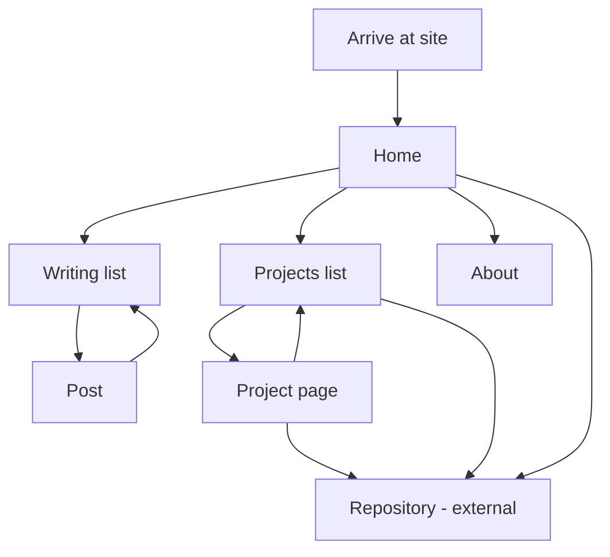

# User Flows — Personal Portfolio & Blog Site

## Sources

- [desc] Initial description: "I want to build a Github.io Blog site to present my work and make blog posts about things I currently learning or I find to be interesting. For UX/UI I want you to use Mobbin"
- [scope] Workflow-selected scope: `feature`.
- [upstream] `ideation/intent-capture/intent-statement.md`, `ideation/scope-definition/scope-document.md`, `ideation/scope-definition/intent-backlog.md`
- [mobbin] Mobbin references listed in `rough-mockups-questions.md`

---

## Flow Map



Text fallback, for anyone the diagram does not render for: a visitor arrives
at Home. From Home they can reach the Writing list, the Projects list, About,
or an external repository link. The Writing list leads to a Post, which leads
back to the Writing list. The Projects list leads to a Project page or
straight out to a repository. A Project page leads back to the Projects list
or out to a repository. [Q1], [Q3], [Q6]

---

## Flow 1 — Recruiter assessing your work (happy path)

Primary flow for the recruiter and hiring-manager audience. [upstream]

```
Flow: Assess what this person has built
Persona: Recruiter or hiring manager [upstream]
Trigger: Follows a link from a CV, profile, or application

Steps:
  1. Home -> lands -> sees the name, one-line description, and both
     sections on one page [Q1]
  2. Home -> scans the Projects section -> reads project names, one-line
     summaries, and the tools each uses without clicking anything [Q1], [Q6]
  3. Home -> selects a project name -> Project page opens with the metadata
     rail (year, type, tools, repo, live link) beside the write-up [Q6]
  4. Project page -> reads as far as they care to -> the rail's facts are
     available at any scroll position without reading the prose [Q6]
  5. Project page -> selects "Repo" -> repository opens externally [Q6]

Success outcome: They can state what you have built and what you used,
without having asked you for anything. [upstream]

Error paths:
  - No projects published yet -> Projects list shows its empty state with a
    route to Writing [upstream]
  - A project has no live URL -> that rail row is omitted rather than shown
    empty [Q6]
  - Bad URL -> 404 page carrying the global shell and links to Writing and
    Projects
```

The fact that step 2 requires no click is deliberate. A recruiter scanning
quickly is the worst case for a site that hides its content one level down,
which is why both sections appear on Home. [Q1], [upstream]

---

## Flow 2 — Developer arriving at a post from search (happy path)

Primary flow for the other-developers audience. [upstream] This flow does not
start at Home, which is what makes it different from Flow 1.

```
Flow: Read the thing that matched the search
Persona: Another developer [upstream]
Trigger: A search result or shared link pointing directly at a post

Steps:
  1. Post -> lands mid-site -> sees the global shell, so the site's shape is
     apparent without going Home first [Q3]
  2. Post -> reads title, one-line summary, date -> decides whether this is
     what they wanted [Q7]
  3. Post -> reads the body in a single narrow column [Q7]
  4. Post -> reaches the end -> "All posts" is there -> selects it [Q8]
  5. Writing list -> sees the other posts as a typographic list [Q2]

Success outcome: They read the post, and the site gave them somewhere to go
next rather than a dead end. [Q8]

Error paths:
  - Only one post exists -> the Writing list shows that one post; the flow
    still terminates somewhere legible rather than on an empty page
    [upstream]
  - Bad post URL -> 404 page with links to Writing and Projects
```

Step 4 is why the back link exists at both ends of the post rather than only
at the top: a visitor who arrived directly and read to the end is exactly the
person who needs a next step, and they are furthest from the header. [Q8]

---

## Flow 3 — Publishing a new post (author flow)

The author is a first-class user of this site, and this flow is a stated
requirement rather than an implementation detail. [upstream]

```
Flow: Publish a post
Persona: You, the site owner [upstream]
Trigger: A post is written and ready

Steps:
  1. Local files -> write the post as a file -> save
  2. Local files -> commit -> push
  3. Site -> the post appears; no further step is taken by the author
     [upstream]

Success outcome: The post is live and appears at the top of the Writing list
and in the Writing section on Home. No publish button, no dashboard, no
separate step to remember. [upstream]

Error paths:
  - The publish step fails after the commit -> the author needs to be able to
    tell that it failed; how that is surfaced is a Construction decision, not
    a design one [assumption]
```

This flow has no screens on the site itself, which is the point: the scope
excludes any CMS or admin interface. [upstream]

---

## Flow 4 — Browsing without a goal (secondary)

```
Flow: Look around
Persona: Someone sent the link directly, or a curious visitor
Trigger: Arrives at Home with no specific intent

Steps:
  1. Home -> reads the intro -> learns who this is [Q1]
  2. Home -> scans both sections -> picks whichever looks interesting [Q1]
  3. Writing list or Projects list -> browses -> selects an item
  4. Post or Project page -> reads -> returns via the back link [Q8], [Q6]
  5. About -> optionally -> finds contact and profile links [upstream]

Success outcome: They know who you are and how to reach you.

Error paths:
  - Both sections empty at once -> Home shows its intro and both empty
    states; this is the launch-day worst case and must not look broken
    [upstream]
```

---

## Keyboard Flow

Applies to every flow above, per the WCAG 2.1 AA bar. [Q5]

```
Tab 1  -> Skip to content
Tab 2  -> Name / home link
Tab 3+ -> Nav links, in visual order
Then   -> Main content links, in reading order
Last   -> Footer links
```

Enter follows a link. No element traps focus, because no page uses a modal,
a dropdown, or any other focus-capturing component. Every focusable element
shows a visible focus indicator. [Q5]

---

## Assumptions & Open Questions

- [assumption] Flow 2 assumes posts will be reached directly from search or a
  shared link rather than only through Home. That is the ordinary way a blog
  post is found, and it is why the global shell appears on every page [Q3],
  but no answer establishes that search traffic is expected — and with
  analytics excluded from scope [upstream], it will not be measured either.
- [assumption] Flow 3's error path assumes the author needs some signal when
  publishing fails. Nothing in the answers establishes what that signal is or
  where it appears; it is named here so Construction does not silently drop
  it.
- [assumption] The reader pains these flows are built around — a recruiter
  scanning quickly, a developer arriving mid-site — are reasoned from the
  confirmed audiences [upstream] rather than from confirmed evidence about
  what those readers struggle with. The intent statement records that gap and
  it is still open.
