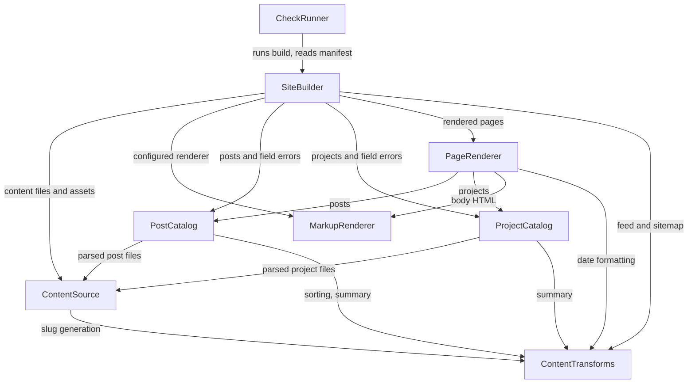

# Component Catalogue — Personal Portfolio & Blog Site

The logical building blocks of this system: the code we write. Databases,
libraries, the file system, and GitHub Pages itself are dependencies **of** these
components, never components.

**What "the system" is here.** Nothing executes while a reader is on the page —
`inception/requirements-analysis/requirements.md` NFR2 and NFR3 forbid it. So
every component below is a build-time building block, and the system whose
boundaries are drawn here is the thing that turns a folder of Markdown into a
folder of HTML, plus the one check runner that verifies what it produced.

**What this stage does not decide.** Deployment topology is Units Generation's
job. No library, language, or framework is named below; where an external
dependency is listed it is named by role, and choosing the product is Code
Generation's call.

## Sources

- [desc] Initial description: "I want to build a Github.io Blog site to present my work and make blog posts about things I currently learning or I find to be interesting. For UX/UI I want you to use Mobbin"
- [scope] Workflow-selected scope: `feature`.
- [upstream] `inception/requirements-analysis/requirements.md` — the functional
  requirements these components realise, the NFR set that constrains how, the
  constraints C1–C8, and OQ3, which named this stage as one of the two places the
  generator question closes. It is closed here: see ADR-001.
- [upstream] `inception/practices-discovery/team-practices.md` — the three
  blocking checks and their pre-push timing, the definition of malformed content,
  the list of what counts as code needing unit tests, the disqualification of
  client-side rendering, the reusable-include rule, and the four controls
  required of any publishing workflow in this repository.
- [upstream] `inception/refined-mockups/mockups.md`,
  `inception/refined-mockups/design-system-mapping.md`,
  `inception/refined-mockups/interaction-spec.md`,
  `inception/refined-mockups/accessibility-checklist.md` — the seven page types,
  the two registers, the global shell, the screen states, and the build-time
  code-colouring contract the renderer must satisfy.
- [Q1]–[Q7] `domain-design-questions.md` — the first pass, which settled the
  component boundaries recorded here.
- [Q8]–[Q13] `domain-design-questions.md` § Revision Pass — the second pass. It
  changed no boundary, no dependency in the system, and no entity's owner; it
  folded back six things the built system knew and this catalogue did not.
- [built] `src/`, `bin/`, `package.json` — the implemented system, and the
  evidence behind every row in § Later additions. Consulted as evidence of what
  **exists**, never as authority over what **should**: where the code and this
  catalogue disagreed, each disagreement was put to the team as a question rather
  than settled by adopting whichever was written last.

Three declared inputs are **absent**, each expectedly:

- `stories` — User Stories is SKIP in this scope
  (`<record>/aidlc-state.md` → Stage Progress), so traceability enumerates
  functional requirements instead of stories.
- `architecture` and `component-inventory` — both are Reverse Engineering
  outputs, and Reverse Engineering is SKIP because this project is greenfield
  (`<record>/aidlc-state.md` → Project Type: Greenfield). There is no existing
  architecture or component inventory to consume.

---

## Component Catalogue

```yaml
components:
  - name: ContentSource
    summary: Finds the content files on disk and turns each one into a parsed record.
    behaviour: >
      Walks only the content directory and never the repository root, which is how
      `aidlc/` and `.claude/` are excluded from the published output by
      construction rather than by an ignore list the author must maintain
      (requirements FR1.6, constraint C2). For each file it splits YAML front
      matter from the Markdown body, derives the slug from the file name via
      ContentTransforms, and reads the draft mark. A file carrying the draft mark
      is dropped from every downstream consumer — page, list, feed, and sitemap
      alike (FR1.3); removing the mark is the only change needed to publish it
      (FR1.4). A file whose front matter cannot be parsed at all is reported as a
      field error naming the file, never skipped silently. It knows nothing about
      which fields a post or a project requires — that belongs to the owning
      catalogue. Alongside the parsed record it reports the item's own directory
      and the files sitting beside it, which is what lets a relative image link in
      a post body resolve in the built output exactly as it does in the source
      tree; copying those files is SiteBuilder's job, not this component's.
    responsibilities:
      - The content-directory boundary, and therefore the publish-output exclusion
      - Front matter / body separation and raw front-matter parsing
      - Draft detection and draft exclusion
      - File-name-to-slug derivation, delegated to ContentTransforms
      - Reporting each item's directory and its adjacent asset files
    depends_on:
      - component: ContentTransforms
        interaction: Slug generation from the file name
        style: sync
    dependents:
      - component: PostCatalog
        interaction: Supplies parsed, non-draft content files of kind post
      - component: ProjectCatalog
        interaction: Supplies parsed, non-draft content files of kind project
      - component: SiteBuilder
        interaction: Loads the content files and reads each item's directory and assets for copying
    external_dependencies:
      - name: Front-matter parser (gray-matter, with js-yaml)
        kind: other
        purpose: >
          Splitting the front-matter block from the body and turning it into a
          key/value map. Chosen at Code Generation; js-yaml is loaded with the
          core schema so front matter parses as plain YAML 1.2 scalars rather
          than admitting YAML 1.1 coercions or arbitrary type construction.
      - name: File system
        kind: other
        purpose: Reading the content directory at build time
    entities:
      - name: ContentFile
        identifier: path
        attributes: [path, directory, kind, slug, frontMatter, body, isDraft, assets]
        # `directory` and `assets` were folded back from the built system — see
        # § Later additions.

  - name: PostCatalog
    summary: Owns what a post is, validates one, and puts posts in order.
    behaviour: >
      Requires title, a one-line summary, and date on every post
      (requirements FR2.5, team practices § Testing Posture). A missing field or
      an unparseable date is returned as a field error naming both the file and
      the field; it is never a warning and never a skipped file, because a build
      that succeeds while dropping a post breaks the site's only mandated
      publishing rule while reporting green (FR1.5). Ordering reads the declared
      front-matter date and never the file's modification time, so a fresh clone
      or a CI checkout cannot silently reorder the Writing list (FR2.2, team
      practices § Code Style). Exposes the ordered post list that Home, Writing,
      the feed, and the sitemap all read.
    responsibilities:
      - The Post entity and its required-field rules
      - Post ordering by declared date, newest first
      - Reporting post field errors for the build to fail on
    depends_on:
      - component: ContentSource
        interaction: Receives parsed non-draft content files of kind post
        style: sync
      - component: ContentTransforms
        interaction: Post sorting and one-line-summary derivation
        style: sync
    dependents:
      - component: SiteBuilder
        interaction: Reads the ordered post list and collects its field errors
      - component: PageRenderer
        interaction: Reads posts to render the Writing list, Home, and post pages
    external_dependencies: []
    entities:
      - name: Post
        identifier: slug
        attributes: [slug, title, summary, date, body, sourcePath]
        # `sourcePath` was folded back from the built system — see § Later additions.
        references:
          - entity: ContentFile
            owned_by: ContentSource
            relationship: "each Post is built from exactly one ContentFile"

  - name: ProjectCatalog
    summary: Owns what a project is and validates one.
    behaviour: >
      Requires name, a one-line summary, year, type, tools, and repo on every
      project; the live URL is optional and its absence is a documented behaviour
      rather than an error — the rail row is omitted entirely rather than rendered
      empty (requirements FR3.3, FR3.4, team practices § Testing Posture). Missing
      required fields are returned as field errors naming file and field, on the
      same fail-loudly contract as posts (FR1.5). Projects are ordered
      featured-first, then by year descending, then by slug ascending. That
      ordering is **total and never a filter**: `featured` decides position and
      can never remove a project from a list, so FR3.1's "every project appears
      once" holds whatever the flag says. Slug ascending is the final tie-break
      precisely so the order is deterministic across machines and fresh clones,
      for the same reason FR2.2 forbids reading file modification time.
    responsibilities:
      - The Project entity and its required-field rules
      - The optional-live-URL rule and its omit behaviour
      - The project ordering rule — featured, then year descending, then slug
      - Reporting project field errors for the build to fail on
    depends_on:
      - component: ContentSource
        interaction: Receives parsed non-draft content files of kind project
        style: sync
      - component: ContentTransforms
        interaction: One-line-summary derivation and project sorting
        style: sync
    dependents:
      - component: SiteBuilder
        interaction: Reads the project list and collects its field errors
      - component: PageRenderer
        interaction: Reads projects to render the Projects list, Home, and project pages
    external_dependencies: []
    entities:
      - name: Project
        identifier: slug
        attributes: [slug, name, summary, year, type, tools, repo, liveUrl, featured]
        references:
          - entity: ContentFile
            owned_by: ContentSource
            relationship: "each Project is built from exactly one ContentFile"
        # `featured` was added by Functional Design for U1 — see § Later additions.

  - name: ContentTransforms
    summary: The small derived functions, in one place, with one coverage target.
    behaviour: >
      Pure functions with no file-system or network access: date formatting,
      one-line-summary derivation, post sorting, project sorting, slug
      generation, feed document construction, and sitemap document construction.
      The first six are exactly the list `team-practices.md` § Testing Posture
      names as the code that needs unit tests, gathered deliberately so the
      inherited 80% line-coverage floor has a single clear target instead of
      several partial ones (requirements NFR12). Project sorting is the seventh
      and sits here for the same reason: it is a pure, branching comparison —
      exactly the shape that list describes — and separating it from post sorting
      would split the coverage figure the gathering exists to keep whole.
      Feed and sitemap construction build the document text and return it; writing
      it to disk is SiteBuilder's job, which is what keeps these functions pure and
      testable. The feed contains every published post and no draft, and collects
      nothing about any reader — it is a static file served from this site
      (FR5.1, FR5.2).
    responsibilities:
      - Date formatting
      - One-line-summary derivation
      - Post sorting by declared date
      - Project sorting by featured, then year descending, then slug ascending
      - Slug generation from a file name
      - Feed document construction
      - Sitemap document construction
    depends_on: []
    dependents:
      - component: ContentSource
        interaction: Slug generation
      - component: PostCatalog
        interaction: Post sorting and summary derivation
      - component: ProjectCatalog
        interaction: Project sorting and summary derivation
      - component: PageRenderer
        interaction: Date formatting for display
      - component: SiteBuilder
        interaction: Feed and sitemap document construction
    external_dependencies: []
    entities: []

  - name: MarkupRenderer
    summary: Turns Markdown into HTML, with code already coloured.
    behaviour: >
      Renders headings, links, lists, images with alt text, and fenced code blocks
      (requirements FR2.6). Syntax colouring is applied here, at build time, and
      never in the reader's browser (FR2.7) — which is also what keeps NFR2 and
      NFR3 satisfiable, since a browser-side highlighter would be both a loading
      state and, if fetched, a third-party request. The colour theme is four token
      classes at most and may not reuse the link accent
      (`refined-mockups/interaction-spec.md` § Code Block). This is the one
      component that wraps substantial third-party code, which is why it is kept
      apart from ContentTransforms — see ADR-003.
    responsibilities:
      - Markdown to HTML rendering
      - Build-time syntax colouring of fenced code blocks
      - Isolating the third-party Markdown and highlighting libraries behind one boundary
    depends_on: []
    dependents:
      - component: PageRenderer
        interaction: Renders post and project bodies to HTML
      - component: SiteBuilder
        interaction: Prepares the configured renderer the build passes to PageRenderer
    external_dependencies:
      - name: Markdown renderer library (markdown-it)
        kind: other
        purpose: >
          Parsing and rendering Markdown to HTML at build time. Chosen at Code
          Generation. Build-time-only is a constraint on this slot, not an
          incidental property of the choice: a renderer that assembled markup in
          the reader's browser would break NFR2, and one fetched from another
          origin would break NFR3.
      - name: Syntax highlighter library (shiki)
        kind: other
        purpose: >
          Colouring fenced code blocks at build time. Chosen at Code Generation.
          The build-time-only constraint binds hardest here: a browser-side
          highlighter is the obvious way to satisfy FR2.7 and is disqualified by
          NFR2 and NFR3 (FR2.7's own test is that the colouring is present with
          JavaScript disabled). Any future replacement must clear the same bar.
    entities: []

  - name: PageRenderer
    summary: Owns the global shell, all seven page templates, and the reusable includes.
    behaviour: >
      Renders the global shell present on every page — name on the left linking
      Home, navigation on the right with the current page marked by
      `aria-current="page"` as well as by the accent underline, and the footer
      (requirements FR4.2, `refined-mockups/mockups.md` § Global Shell). The skip
      link is the first focusable element on every page, tab order follows visual
      order, and every focusable element carries the focus ring (NFR1). Renders
      the seven page types — Home, Writing, Post, Projects, Project, About, 404 —
      in the two registers the design defines, each with its empty state where one
      applies. Emits the per-page head metadata: title, description, Open Graph
      and Twitter-card tags, and deliberately no preview image in this version
      (FR5.3, FR5.4, FR5.5). Emits the content-security-policy meta tag that
      enforces the no-third-party-request rule (NFR4), because GitHub Pages sets
      no response headers (constraint C4). A presentation capability a layout
      lacks becomes a named reusable include here, used by name from a post,
      never one-off markup pasted into prose (team practices § Code Style).
      Templates branch on entity kind rather than sharing one; there is no
      client-side rendering anywhere, which is the pass/fail test for NFR2.
    responsibilities:
      - The global shell, head metadata, and CSP meta tag
      - All seven page templates and their empty states
      - The named reusable includes
      - The accessibility contract of the rendered markup
    depends_on:
      - component: PostCatalog
        interaction: Reads posts for Home, the Writing list, and post pages
        style: sync
      - component: ProjectCatalog
        interaction: Reads projects for Home, the Projects list, and project pages
        style: sync
      - component: MarkupRenderer
        interaction: Renders post and project bodies to HTML
        style: sync
      - component: ContentTransforms
        interaction: Date formatting for display
        style: sync
    dependents:
      - component: SiteBuilder
        interaction: Asks for each page's rendered HTML
    external_dependencies: []
    entities:
      # SiteMetadata was added by Functional Design for U1 — see § Later additions.
      - name: SiteMetadata
        identifier: "(singleton)"
        attributes: [siteName, baseUrl, fallbackDescription, contentSecurityPolicy]

  - name: SiteBuilder
    summary: The build. Orders the work, fails loudly, and writes the output.
    behaviour: >
      Runs the phases in order: load content, validate, render, write. Validation
      is a step of this build that cannot be skipped — there is no separate linter
      to forget and no way to invoke a generator directly and bypass it, because
      the build is ours (requirements FR1.5, [Q1], [Q2]). It collects the field
      errors returned by PostCatalog and ProjectCatalog and, if any exist, fails
      the build with a message naming each file and each missing field, rather
      than skipping those files. A build that fails writes nothing, which is what
      leaves the previously live site serving (FR1.7). On success it writes every
      page, the feed, and the sitemap; copies the site's own assets — the
      stylesheet and the self-hosted font — into the output; copies each item's
      adjacent files beside that item's page, so a relative image link in a body
      resolves in the built output exactly as it does in the source tree; and
      records what it wrote in a BuildManifest — the record CheckRunner's second
      check reads, so that check never has to guess what should have been
      produced. All copying happens in the write phase, after validation, so a
      content fault still stops the build before anything is written.
    responsibilities:
      - Build phase ordering
      - The fail-loudly contract: aggregate field errors, name file and field, abort
      - Writing pages, feed, and sitemap to the output directory
      - Copying the site's own assets and each item's adjacent files into the output
      - Recording what was written
    depends_on:
      - component: ContentSource
        interaction: Loads the content files, and reads each item's directory and assets for copying
        style: sync
      - component: MarkupRenderer
        interaction: Prepares the configured renderer passed to PageRenderer
        style: sync
      - component: PostCatalog
        interaction: Loads posts and collects post field errors
        style: sync
      - component: ProjectCatalog
        interaction: Loads projects and collects project field errors
        style: sync
      - component: PageRenderer
        interaction: Obtains each page's rendered HTML
        style: sync
      - component: ContentTransforms
        interaction: Obtains the constructed feed and sitemap documents
        style: sync
    dependents:
      - component: CheckRunner
        interaction: Runs the build as check 1 and reads its BuildManifest for check 2
    external_dependencies:
      - name: File system
        kind: other
        purpose: Writing the built site and its copied assets to the output directory
    entities:
      - name: BuildManifest
        identifier: buildId
        attributes: [buildId, outputRoot, pagesWritten, sourceToOutput, startedAt]
        references:
          - entity: ContentFile
            owned_by: ContentSource
            relationship: "each sourceToOutput row maps one ContentFile to the page written from it"

  - name: CheckRunner
    summary: One command that runs all three blocking checks and reports together.
    behaviour: >
      Runs the build, then the two checks that can only run against its output,
      and reports all failures together rather than stopping at the first
      (requirements NFR9, team practices § Testing Posture). Check 1 is the build
      itself. Check 2 confirms every non-draft content file produced an output
      page, read from the BuildManifest, and ignores drafts entirely (NFR10).
      Check 3 confirms internal links resolve across the built output. External
      links are never checked and never block: a dead third-party URL is somebody
      else's outage, and failing on it would stop this site publishing because an
      unrelated website went down (NFR11). Any failure is blocking. This runner is
      what the author invokes before a push and what the publishing workflow
      invokes as its remote backstop — one runner, so the two cannot drift.
    responsibilities:
      - Invoking the build as check 1
      - Check 2: every non-draft content file produced an output page
      - Check 3: internal links resolve across the built output
      - Reporting all three outcomes together, blocking on any failure
    depends_on:
      - component: SiteBuilder
        interaction: Runs the build and reads its BuildManifest
        style: sync
    dependents: []
    external_dependencies:
      - name: File system
        kind: other
        purpose: Reading the built output to resolve internal links
    entities:
      - name: CheckReport
        identifier: buildId
        attributes: [buildId, buildResult, pageCoverageResult, internalLinkResult, failures]
        references:
          - entity: BuildManifest
            owned_by: SiteBuilder
            relationship: "each CheckReport describes exactly one BuildManifest"
```

---

## Component Diagram



<!-- Text fallback: eight boxes. ContentTransforms sits at the bottom with no
dependencies of its own and is called by ContentSource, PostCatalog,
ProjectCatalog, PageRenderer and SiteBuilder. MarkupRenderer likewise has no
dependencies and is called by PageRenderer and SiteBuilder. ContentSource is
called by PostCatalog, ProjectCatalog and SiteBuilder. PageRenderer calls both
catalogues, the renderer and the transforms. SiteBuilder calls ContentSource,
MarkupRenderer, both catalogues, PageRenderer and ContentTransforms. CheckRunner
calls SiteBuilder alone and nothing calls CheckRunner. The graph flows in one
direction with no cycles. -->

---

## Component Summary

| Component | Purpose | Depends On | Dependents | Entities Owned |
|---|---|---|---|---|
| ContentSource | Finds content files, parses front matter, drops drafts, reports adjacent assets | ContentTransforms | PostCatalog, ProjectCatalog, SiteBuilder | ContentFile |
| PostCatalog | What a post is; validation and ordering | ContentSource, ContentTransforms | SiteBuilder, PageRenderer | Post |
| ProjectCatalog | What a project is; validation and ordering | ContentSource, ContentTransforms | SiteBuilder, PageRenderer | Project |
| ContentTransforms | The small derived functions, unit-tested in one place | — | ContentSource, PostCatalog, ProjectCatalog, PageRenderer, SiteBuilder | — |
| MarkupRenderer | Markdown to HTML, code coloured at build time | — | PageRenderer, SiteBuilder | — |
| PageRenderer | Global shell, seven page templates, reusable includes | PostCatalog, ProjectCatalog, MarkupRenderer, ContentTransforms | SiteBuilder | SiteMetadata |
| SiteBuilder | Build ordering, fail-loudly validation, output and asset writing | ContentSource, MarkupRenderer, PostCatalog, ProjectCatalog, PageRenderer, ContentTransforms | CheckRunner | BuildManifest |
| CheckRunner | One command running all three blocking checks | SiteBuilder | — | CheckReport |

---

## Entity Ownership

Ownership and shape only. Data types, validation constraints, allowed values, and
relationship cardinality belong to Functional Design, not here.

| Entity | Owning Component | Identifier | Attributes | References |
|---|---|---|---|---|
| ContentFile | ContentSource | path | path, directory, kind, slug, frontMatter, body, isDraft, assets | — |
| Post | PostCatalog | slug | slug, title, summary, date, body, sourcePath | ContentFile (ContentSource) — each Post is built from exactly one ContentFile |
| Project | ProjectCatalog | slug | slug, name, summary, year, type, tools, repo, liveUrl, featured | ContentFile (ContentSource) — each Project is built from exactly one ContentFile |
| SiteMetadata | PageRenderer | (singleton) | siteName, baseUrl, fallbackDescription, contentSecurityPolicy | — |
| BuildManifest | SiteBuilder | buildId | buildId, outputRoot, pagesWritten, sourceToOutput, startedAt | ContentFile (ContentSource) — each sourceToOutput row maps one ContentFile to the page written from it |
| CheckReport | CheckRunner | buildId | buildId, buildResult, pageCoverageResult, internalLinkResult, failures | BuildManifest (SiteBuilder) — each CheckReport describes exactly one BuildManifest |

Every entity has exactly one owning component. Two attributes in the set are
optional, and each absence has a defined behaviour rather than being an error:
`liveUrl` absent omits the rail row entirely (FR3.4), and `featured` absent means
false, which affects only sort position and can never remove a project from a
list.

### A cross-component contract that is not an entity

`FieldError` is the shape every validation boundary passes: `ContentSource`
returns one for front matter it cannot parse, `PostCatalog` and `ProjectCatalog`
return one per missing or unparseable required field, and `SiteBuilder` collects
them all to produce the message that names each file and each field before
aborting (FR1.5). It carries the file path, the field, and the message.

It is deliberately **not** listed as an entity and has no owning component. An
entity here is a thing the site is about; `FieldError` is how components tell each
other that a thing is malformed. Recording it anyway, because the fail-loudly
contract is the requirement this system is most specific about, and a contract
that four components share should not be invisible in the document that describes
their boundaries.

### Later additions

Some rows above were **not** written by this stage's first pass. They are folded
back here so this catalogue and the built system do not silently disagree, and
the table says where each came from.

| Addition | Added by | Why it was needed |
|---|---|---|
| `Project.featured` | Functional Design (U1), [Q4] and [Q7] | Home shows a subset of projects. `featured` orders rather than selects, so no state exists in which projects exist and Home's Projects section is empty. Optional with a `false` default, so it cannot affect FR3.3's six required fields. |
| `SiteMetadata` | Functional Design (U1), [Q5] | The site name, base URL, fallback page description, and content-security-policy value are needed by FR5.2, FR5.3, FR5.4 and NFR4, and none of them is authored content — so none belongs to `ContentSource` or either catalogue. `PageRenderer` already owns head metadata and the policy tag, so no new component is introduced. |
| The project ordering rule on `ProjectCatalog`, and project sorting as a seventh `ContentTransforms` function | Code Generation, folded back at [Q9] | The first pass recorded that projects carry no ordering rule, because nothing upstream declared one. The built system does have one — featured, then year descending, then slug ascending — so the catalogue was describing a system that no longer existed. See ADR-008. |
| `ContentFile.directory`, `ContentFile.assets`, `Post.sourcePath`, and asset copying on `SiteBuilder` | Code Generation, folded back at [Q10] | The build copies the site's own stylesheet and font, and each item's adjacent files, so a relative image link resolves in the output as it does in the source. Nothing in the first pass named an owner for that. Folded into existing components rather than given a ninth: it is roughly forty lines of copying in the write phase. |
| `SiteBuilder` → `ContentSource` and `SiteBuilder` → `MarkupRenderer` | Code Generation, folded back at [Q13] | Both edges exist in the built system and neither was declared. Recording them is what keeps this catalogue's own symmetry rule true once `SiteBuilder` reads `ContentFile.assets`. |
| Library names on the External Dependencies table | Code Generation, folded back at [Q11] | The first pass named these by role and left the product choice to Code Generation, which has since made it. The names are recorded with the build-time-only constraint that governs any future replacement. |

No addition in this table changes a component boundary or an entity's owner, and
none required a change to `src/`. Each records something the built system already
does. If a later unit needs to change one, that is a change to this table rather
than a second definition elsewhere.

---

## External Dependencies

Infrastructure and third-party code these components use. None of these is a
component. The first pass named each by role and left the product choice to Code
Generation; that choice has since been made, so the chosen name is recorded
beside the role ([Q11]). The **role and its constraint are the durable part** —
the name is what currently fills the slot, and `package.json` remains
authoritative for versions.

| Component | Dependency | Chosen | Kind | Purpose |
|---|---|---|---|---|
| ContentSource | Front-matter parser | `gray-matter`, with `js-yaml` on the core schema | other | Splitting front matter from the body and parsing it to a key/value map |
| ContentSource | File system | — | other | Reading the content directory at build time |
| MarkupRenderer | Markdown renderer library | `markdown-it` | other | Parsing and rendering Markdown to HTML at build time |
| MarkupRenderer | Syntax highlighter library | `shiki` | other | Colouring fenced code blocks at build time |
| SiteBuilder | File system | — | other | Writing the built site and its copied assets to the output directory |
| CheckRunner | File system | — | other | Reading the built output to resolve internal links |

**Every one of these runs at build time only, and that is a constraint on the
slot rather than a property of the current occupant.** Nothing here executes while
a reader is on the page, and nothing is fetched from another server at page load
— which is how NFR2, NFR3 and NFR4 stay satisfied by construction rather than by
vigilance. The constraint binds hardest on the highlighter, where the obvious
implementation is a browser-side one: FR2.7's own pass/fail test is that the
colouring is present with JavaScript disabled. A replacement for either the
renderer or the highlighter must clear the same bar, and swapping one for a
browser-side equivalent is a requirements violation rather than a library
upgrade.

The front-matter parser carries a smaller constraint of the same kind: `js-yaml`
is loaded with the core schema, so front matter parses as plain YAML 1.2 scalars.
That rules out YAML 1.1 coercions and arbitrary type construction from a content
file, which matters because front matter is the one place authored content
reaches the build as structured data.

---

## Component-boundary options

Two decompositions here had more than one viable shape. Both are settled below
with the trade-off stated, and both are reversible; you can change either at the
gate.

### Option block 1 — where Markdown rendering lives

[Q3] placed shared behaviour — slug derivation, draft filtering, Markdown
rendering — in "a component both depend on". [Q5] placed six named derived
functions in one shared component. Markdown rendering appears in the first list
and not in the second, so whether it joins them is open.

- **Option A — one shared component holding both.** Everything shared in one
  place: the six derived functions plus Markdown rendering and syntax colouring.
  Pros: one import, one thing to find. Cons: the component's coverage figure now
  mixes pure functions against a wrapper around two third-party libraries, and
  the 80% floor stops having the clean target [Q5] chose it for. Reversibility:
  easy — splitting later is a file move.
- **Option B — keep them apart: ContentTransforms and MarkupRenderer.** The six
  pure functions in one component; Markdown rendering and colouring in another.
  Pros: ContentTransforms is pure, has no external dependencies, and is the
  single clear coverage target NFR12 needs; MarkupRenderer isolates the only
  substantial third-party code on the site behind one boundary, which matters
  because that is where a future browser-side highlighter would break NFR2 and
  NFR3. They also change for different reasons — the transforms change when a
  display rule changes, the renderer when a library is upgraded. Cons: one more
  component than [Q5] literally implies. Reversibility: easy.
- **Recommendation: Option B**, and it is what the catalogue above records.
  [Q5]'s six named functions stay together exactly as chosen; the split only
  declines to add a seventh thing that was never in that list. The deciding
  trade-off is change rate: a library upgrade and a date-format change should not
  touch the same component.

### Option block 2 — whether ContentSource is its own component

- **Option A — fold discovery and parsing into the two catalogues.** PostCatalog
  and ProjectCatalog each walk their own directory and parse their own front
  matter. Pros: two components instead of three; each catalogue is
  self-contained. Cons: the content-directory boundary is then stated in two
  places, and FR1.6 — excluding `aidlc/` and `.claude/` from published output —
  is the requirement that boundary enforces. Two copies of a rule that C2 makes
  load-bearing is two places for it to drift. Reversibility: easy.
- **Option B — one ContentSource owning the boundary.** Pros: the exclusion
  rule, draft handling, and front-matter separation exist once; the catalogues
  own field rules and nothing else. Cons: a third component in the load path.
  Reversibility: easy.
- **Recommendation: Option B**, recorded above. The deciding factor is that C2
  makes the content-directory boundary a security-shaped rule rather than a
  convenience, and a rule like that should have exactly one home.

---

## Rationale

Why each of these is a separate building block.

| Component | Why it is separate | Alternatives rejected |
|---|---|---|
| ContentSource | Distinct concern: it owns the content-directory boundary, which is what excludes `aidlc/` and `.claude/` from the published output (FR1.6, C2). Distinct change rate: it changes when the on-disk layout changes, not when a field is added. | Folding discovery into each catalogue — see option block 2. Rejected because it would state the exclusion rule twice. |
| PostCatalog | Distinct data ownership: it owns the Post entity and the only rules about what a post must carry. Distinct change rate from projects — the two field sets move independently. | One `ContentItem` entity with a `kind` field ([Q3] option B), and two entities on a shared base ([Q3] option C). Both rejected at [Q3]. |
| ProjectCatalog | Same reasoning, mirrored: it owns the Project entity, its six required fields, the optional-live-URL omit rule (FR3.3, FR3.4), and the ordering rule (featured, then year descending, then slug ascending — ADR-008). | As above. For the ordering rule specifically: leaving it unstated, which is what the first pass did, and moving the sort into `ProjectCatalog` itself ([Q9] option C). The first was rejected because the system has a rule and the catalogue was describing one that did not; the second because it would move a pure branching function out from under `ContentTransforms`' single coverage target. |
| ContentTransforms | Distinct concern and distinct testability: these six functions are exactly what `team-practices.md` names as needing unit tests, and gathering them gives NFR12's coverage floor one target instead of several. Purity is the property being protected — no file system, no network. | Distributing each function to its user ([Q5] option B) and splitting by nature ([Q5] option C). Both rejected at [Q5]: each would fragment the coverage figure. |
| MarkupRenderer | Distinct dependency surface: the only component wrapping substantial third-party code. Isolating it is what makes FR2.7's build-time-only colouring checkable in one place rather than a property to re-verify everywhere. | Merging it into ContentTransforms — see option block 1. Rejected on change rate and coverage clarity. |
| PageRenderer | Distinct concern: markup and its accessibility contract. It is deliberately large — [Q6] chose one rendering component because templates are configuration more than logic, and splitting them creates boundaries with nothing behind them. The honest consequence is visible in the traceability file: most FR2 to FR5 requirements land here. | Shell separate from page templates ([Q6] option B) and a split by visual register ([Q6] option C). Both rejected at [Q6]; the register split in particular leaves the shell belonging to neither side. |
| SiteBuilder | Distinct lifecycle: it is the build, and it owns the one thing the requirements are most specific about — failing loudly and writing nothing when content is malformed (FR1.5, FR1.7). Validation lives inside it because [Q2] required a step that cannot be skipped. It also owns writing, which is why asset copying sits here: copying happens in the write phase, after validation, so a content fault still stops the build before anything reaches the output. | Validation as a separate script run before the build ([Q2] option B), and a schema enforced natively by an adopted generator ([Q2] option C). Both rejected at [Q2]; option C is moot under [Q1]'s answer, since no generator is adopted. For asset copying specifically: a separate `AssetPipeline` component ([Q10] option B), rejected as a ninth component for roughly forty lines of copying that shares SiteBuilder's write-phase lifecycle exactly. |
| CheckRunner | Distinct concern and distinct invocation: it is what a human runs before a push and what the publishing workflow runs as a backstop. Keeping it one runner is what stops the local and remote check sets drifting apart. | Build plus a separate output-check command ([Q4] option B) and folding check 2 into the build ([Q4] option C). Both rejected at [Q4]. |

**No deliberate cycles.** The dependency graph is acyclic. ContentTransforms and
MarkupRenderer are both leaves; CheckRunner is the only root. The two edges
recorded at [Q13] — `SiteBuilder` → `ContentSource` and `SiteBuilder` →
`MarkupRenderer` — add no cycle: `SiteBuilder` already sat above both, and
neither reaches back to it.

**One thing this catalogue does not contain, deliberately.** The GitHub Actions
workflow that publishes the site ([Q7]) is not a component. It is deployment
configuration, not a logical building block of the code, and it belongs to CI
Pipeline (stage 3.7), which is in scope for this workflow. What Domain Design
owes it is recorded in ADR-005: the workflow's only job is to run CheckRunner and
deploy SiteBuilder's output, so nothing above changes shape because of it.

**What is not designed around.** Comments, an email newsletter, analytics or
tracking of any kind, and any authoring path beyond editing files directly are
excluded entirely rather than deferred. No component above carries a hook,
extension point, placeholder, or commented-out scaffolding for any of them.
