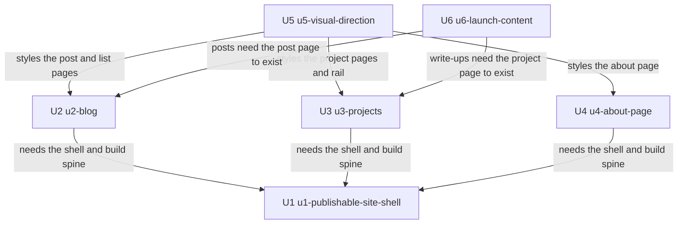

# Unit Dependency Graph — Personal Portfolio & Blog Site

Topology only: what *can* depend on what. This document does not pick a build
order and does not identify a critical path. The approved build order lives in
`ideation/scope-definition/intent-backlog.md` § Build Order and is unchanged by
anything here.

## Sources

- [upstream] `inception/domain-design/components.md` — the component dependency
  graph these unit edges sit on top of
- [upstream] `inception/domain-design/decisions.md` — ADR-005, which places the
  publishing workflow in U1 rather than in a pipeline stage
- [upstream] `inception/requirements-analysis/requirements.md` — C1, which makes
  every unit embedded in one build, so there are no deployment-ordering edges
- [upstream] `ideation/scope-definition/intent-backlog.md` — the proto-Unit
  dependency table this graph refines, and the reason for the one refinement
- [upstream] `inception/practices-discovery/team-practices.md` — the
  walking-skeleton stance that makes U1 the root, and the keyboard-walkthrough
  rule that makes U5's inbound edges real
- [Q3], [Q5] `units-generation-questions.md` — the first pass, which settled the
  edges below.
- [Q8] `units-generation-questions.md` § Revision Pass — added the static-asset
  row to § Integration points. No edge in the block or the graph changed: the
  revised `components.md` moved no component and no dependency, and the DAG was
  diffed against it before this pass wrote anything.

The `stories` input is absent: User Stories is SKIP in this scope.

---

## Edge Block

```yaml
units:
  - name: u1-publishable-site-shell
    depends_on: []
  - name: u2-blog
    kind: ui
    depends_on: [u1-publishable-site-shell]
  - name: u3-projects
    kind: ui
    depends_on: [u1-publishable-site-shell]
  - name: u4-about-page
    kind: ui
    depends_on: [u1-publishable-site-shell]
  - name: u5-visual-direction
    kind: ui
    depends_on: [u2-blog, u3-projects, u4-about-page]
  - name: u6-launch-content
    depends_on: [u2-blog, u3-projects]
```

`u1-publishable-site-shell` and `u6-launch-content` carry no `kind`, which puts
them on the full construction design-artifact matrix. The reason for each
omission is in `unit-of-work.md` § Unit Index; U6's design stage is expected to
resolve as not applicable with its reason recorded, rather than producing an
artifact for a unit that contains no code.

---

## Graph



<!-- Text fallback: six boxes. U1, the publishable site shell, depends on
nothing and sits at the root. U2 the blog, U3 projects, and U4 the about page
each depend on U1 alone and on nothing else, so all three are mutually
independent. U5, the visual direction, depends on all three of U2, U3 and U4.
U6, launch content, depends on U2 and U3. Nothing depends on U5 or U6. The graph
flows in one direction with no cycles. -->

---

## Edges, and why each one exists

| Edge | Kind of dependency | Why |
|---|---|---|
| U2 → U1 | Real | The blog deepens components U1 established. Without the build spine and the shell, there is no page to put a post on. |
| U3 → U1 | Real | Same reasoning, for projects. |
| U4 → U1 | Real | Same reasoning, for About. |
| U5 → U2, U3, U4 | Real | U5's deliverable is the treatment **applied across the site**, and that cannot be applied to, or verified against, pages that do not exist. `team-practices.md` makes this concrete: the keyboard walkthrough must run again on each page type *after* the visual styling, which requires the page types to have been built. |
| U6 → U2, U3 | Real | A post is content for the post page; a write-up is content for the project page. Neither can be published before its page type exists. Matches the approved backlog's PU-6 depends-on PU-2 and PU-3. |

**One refinement of the approved backlog, stated openly.**
`intent-backlog.md` records PU-5 as depending on PU-1 only, while placing it
after PU-4 in the build order with a cost argument — applying a visual direction
to pages that already exist is cheaper than designing pages that do not. This
graph draws the edge to U2, U3 and U4 instead, because the dependency is not
only economic: the unit's own definition of done cannot be evaluated without the
pages. The build order is unaffected — it already placed PU-5 after PU-4 — so
this changes no plan, only the reason recorded for the placement.

**No edge is a preference.** [Q3] settled that the blog and projects are
independent siblings even though the build order names one before the other. The
graph records the constraint, not the choice, so a future reader can tell the
difference. There is no U2 → U3 edge and no U3 → U2 edge.

---

## Integration points between units

There is no inter-unit API, message contract, or shared schema to formalise, and
that is a property of this system rather than an omission. Contract Design is
SKIP in this scope for the same reason.

What crosses a unit boundary here is **source code in the same repository,
inside components the catalogue already defines**. The contracts are the
component interfaces in `components.md`, which every unit reads and none
redefines:

| Boundary | What crosses it | Where the contract lives |
|---|---|---|
| U1 → U2 | `PostCatalog`'s post list and field errors; `PageRenderer`'s shell and head metadata; the build phases | `components.md` § Component Catalogue |
| U1 → U3 | `ProjectCatalog`'s project list and field errors; the same shell and build phases | `components.md` § Component Catalogue |
| U1 → U4 | The global shell and the page-template conventions | `components.md` § Component Catalogue |
| U2, U3, U4 → U5 | The rendered markup and its class and landmark structure, which the stylesheet targets | `refined-mockups/design-system-mapping.md` and `interaction-spec.md` |
| U2, U3 → U6 | The required front-matter field sets for posts and projects | `requirements.md` FR2.5, FR3.3 |
| U5, U2 → U1 | Static asset files: U5's stylesheet and self-hosted font, and the images sitting beside a post or project. `SiteBuilder` copies them into the output; the units that author them place them where it looks. | `components.md` § Component Catalogue → `SiteBuilder` |

**On that last row.** It is the one boundary here where a unit's deliverable
depends on a mechanism another unit owns, so it is worth being explicit about
what it does and does not imply. It adds **no DAG edge**: U5 already reaches U1
transitively through U2, U3 and U4, and U2 depends on U1 directly. What it adds
is a place to look when an asset is missing from the live site — the fault is
either the file, which belongs to U5 or U2, or the path `SiteBuilder` expects,
which belongs to U1.

Because everything lands in one build and one deployable (`requirements.md`
C1), there is no versioning, no backward compatibility window, and no failure
behaviour to specify at any of these boundaries. A breaking change to a
component is caught by the build, not by a contract.

---

## Parallel development opportunities

Sets of units with no dependency between them, so more than one valid
topological ordering exists:

| Set | Members | Note |
|---|---|---|
| A | U2, U3, U4 | Once U1 is done, all three are available and mutually independent. Any of the six orderings of these three is topologically valid. |

No other parallel set exists: U1 is the sole root, and U5 and U6 each wait on
members of set A.

**What this means, and what it does not.** With one author there is no literal
concurrency to exploit; the value of recording set A is that it says the
approved order of U2, U3 and U4 is a choice and can be revisited without
breaking anything. Whether to revisit it is not this document's call.

**Nothing depends on U5 or U6.** Both are graph leaves. That is worth noting for
a different reason than parallelism: a leaf is the easiest unit to quietly drop
when effort runs short, and both of these are Must Have in the approved backlog.
