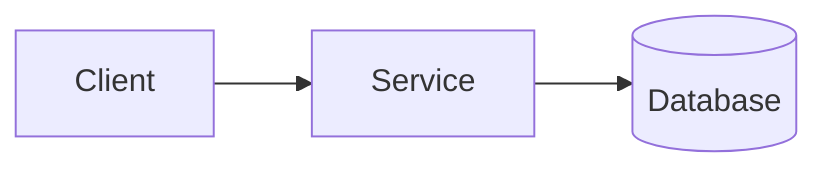

<!-- Setup, commands and deploy steps belong in the repo README, next to the code that
     makes them true. This page is for the reasoning, which does not rot. -->

|             |                                                       |
| ----------- | ----------------------------------------------------- |
| **Status**  | Building <!-- Idea · Building · Running · Shelved -->  |
| **Started** | {{ dateFormat "January 2006" .Date }}                  |
| **Stack**   |                                                        |
| **Source**  | Private repo                                           |

## What it is

One paragraph, no jargon, aimed at someone who has never heard of it. If you can't write
this without reaching for a diagram, the project isn't yet clear in your own head.

## Why it exists

The actual problem. What you tried first, or what existing tools did badly enough that
building your own was the lesser evil. This is the part people relate to.

## Key decisions

The heart of the page. One block per decision you'd have to re-justify if someone asked
"why not just…". Skip the obvious ones; record the ones with a real trade-off.

### Decision goes here

**Chose:** what you did.

**Because:** the reasoning, including the constraint that forced it.

**Trade-off:** what it costs you, and when it would stop being the right call.

## How it fits together

Architecture at a level that survives refactors — components and the boundaries between
them, not file names.

## Status

What works today and what's next. Concrete enough to be falsifiable.

- [x] Something finished
- [ ] Something next

## What I learned

The transferable part — what you'd do differently, or what this taught you that applies
beyond this project. Link to a [journal](/blog/) post if you wrote one up.
