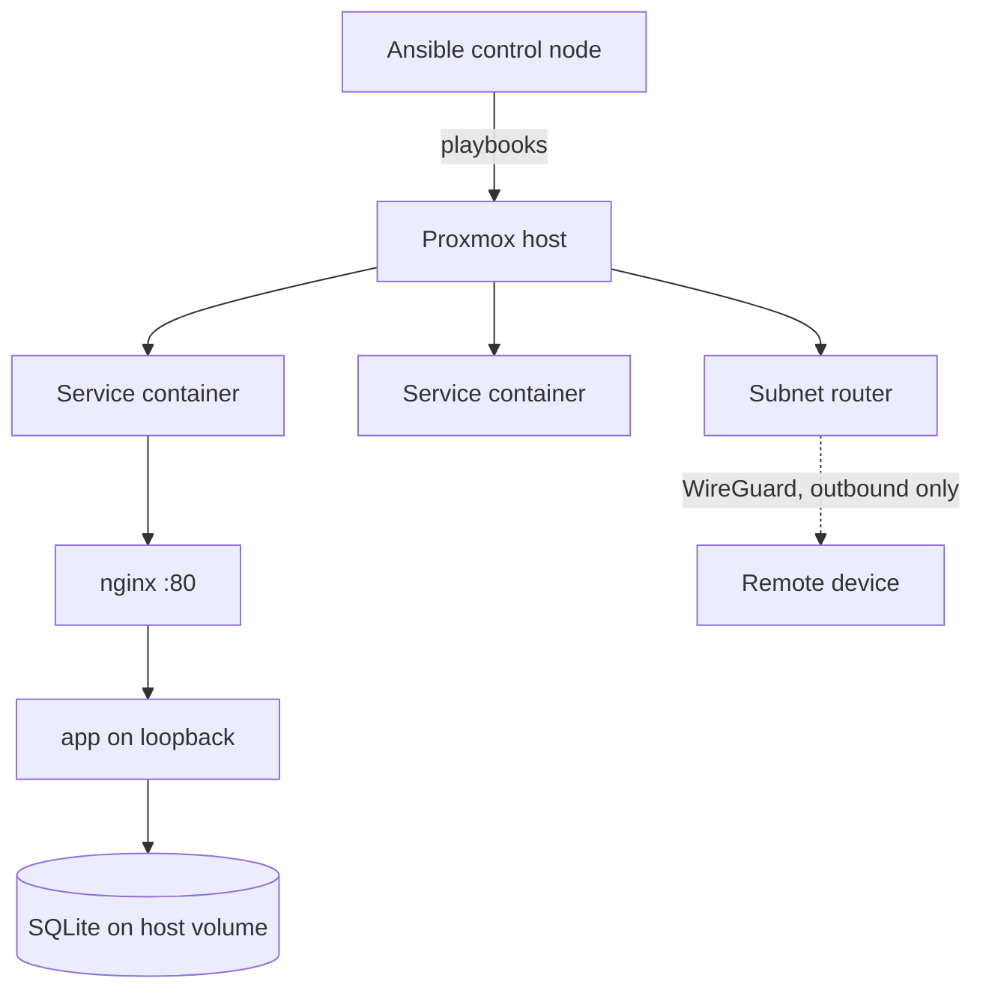

|             |                                        |
| ----------- | -------------------------------------- |
| **Status**  | Running                                |
| **Started** | April 2026                             |
| **Stack**   | Ansible · Proxmox · Debian · systemd · nginx · Tailscale |
| **Source**  | Private repo                           |

## What it is

A small Proxmox server at home, and the Ansible repository that configures every machine
on it. Nothing is set up by hand: each service — DNS filtering, a retro-games box, a
couple of self-hosted web apps — lives in its own lightweight container, and a playbook
turns an empty container into that running service. If a box breaks, the fix is to re-run
the playbook rather than to remember what I clicked.

## Why it exists

I wanted the self-hosted services, but the thing I actually wanted was to stop being the
single point of failure. A homelab configured by hand is a pile of undocumented decisions
that exist only in your head, and the cost shows up months later when something breaks
and you can't reconstruct why it was set up that way.

Writing it as Ansible forces the configuration to be explicit and re-runnable. The
secondary benefit turned out to be the bigger one: infrastructure-as-code is the same
skill whether the target is a homelab or production, so the practice transfers.

## Key decisions

### App-per-container, built on the host — no container images

**Chose:** each service gets its own LXC. Ansible converges it, systemd supervises the
process. No Docker, no image registry, no CI pipeline.

**Because:** the benefits of an image-based workflow scale with team size and service
count, and both are approximately one here. Running Docker *inside* LXC also adds nesting
and privilege complexity that buys nothing at this scale. The container is already the
unit of isolation; adding a second containerisation layer inside it is pure cost.

**Trade-off:** builds happen on the host, so each service box needs a toolchain, and
there's no portable artifact to ship elsewhere. If a host ever has to stay toolchain-free,
or builds get slow enough to want CI, only the checkout-and-build step changes — the rest
of the model stands.

### A pinned git tag is the deployable unit

**Chose:** application repos live separately from the infrastructure repo, referenced by
URL plus a pinned git tag. The playbook checks that tag out into a timestamped release
directory, builds it, applies migrations, flips a `current` symlink, and restarts the unit.

**Because:** this recovers the part of an image workflow that actually matters — an
immutable, named thing you can point at and say "that version is deployed" — without
needing a registry to store it. The tag *is* the image tag.

**Trade-off:** rollback means repointing the symlink at the previous release or re-running
at the old tag. That's a manual step rather than an orchestrator's job, which is fine at
one operator and a handful of services.

### Remote access via outbound-only tunnel, never an open port

**Chose:** a dedicated container advertises the LAN route into a Tailscale tailnet, so
remote devices reach internal addresses directly over WireGuard.

**Because:** it gives remote access without opening a single inbound port on the home
router. The tunnel is established outbound, so from the internet's perspective there is
nothing listening and nothing to find. Services stay bound to the LAN — which also means
no public TLS to manage, since Let's Encrypt needs a reachability that deliberately
doesn't exist here.

**Trade-off:** connectivity now depends on a third-party coordination service, and any
compromised enrolled device gets LAN-level reach.

### Container ID derived from the address

**Chose:** a container's numeric ID matches the last octet of its address, and hostnames
follow a `<service>NN` pattern.

**Because:** it removes a lookup. Knowing any one of ID, hostname or address gives you the
other two, which matters when moving between the Proxmox UI, an inventory file and an SSH
session.

**Trade-off:** only works on a single flat subnet, and breaks quietly if the network is
ever segmented. Cheap to abandon when that happens.

## How it fits together

Playbooks are layered rather than monolithic: provisioning creates the container, a
`common` role applies base configuration, then service-specific roles install the runtime,
deploy the app, and enable a reverse proxy. A new service reuses everything except its own
role.

## Status

- [x] Container and VM provisioning from a playbook
- [x] Base configuration role applied across hosts
- [x] Reverse proxy role, opt-in per host
- [x] DNS filtering, retro-games and two web app services deployed
- [x] Subnet router for remote access
- [ ] A dedicated base-configuration playbook layer — roles exist, the playbook doesn't
- [ ] Backup and restore that has actually been tested by restoring

## What I learned

**The reasoning is worth more than the automation.** The playbooks are maybe half the
value; the other half is the architecture notes written while deciding — the record of
what was considered and rejected. Six weeks on I could no longer reconstruct why images
were rejected, and the note explaining it was what let me extend the model to a second
service without re-litigating the whole design.

**The second service is where the abstraction gets tested.** The first role is always
over-fitted to its one use case. Deploying a second app of the same shape immediately
exposed which parts were genuinely service-agnostic and which had the first service's
assumptions baked in.
