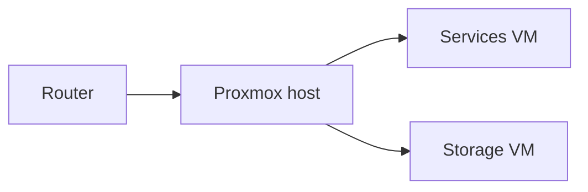

Placeholder project page — kept as a structural example. Replace or delete it.

## What it is

One paragraph a stranger could read and understand.

## Why I built it

The actual motivation, including what existing options didn't do.

## Architecture

## Setup

{}

### Provision the host

### Deploy the base services

### Wire up reverse proxy and TLS

{}

## Progress log

| Date | What changed |
|---|---|
| 2026-07-31 | Started documenting |

## Open questions
