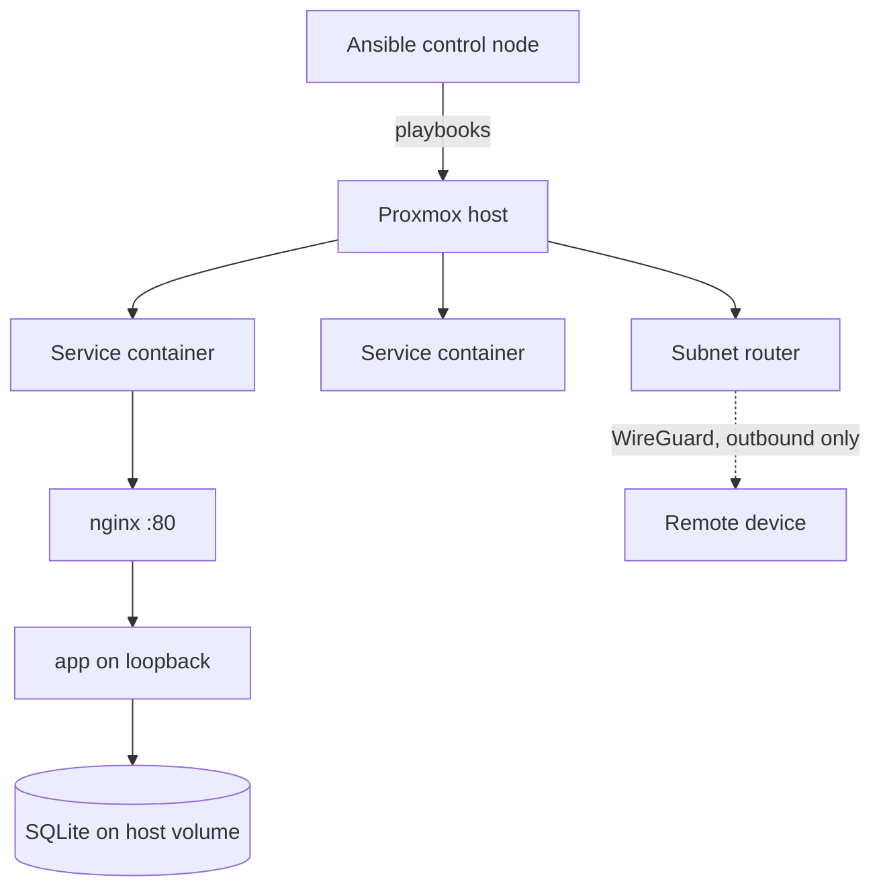

|             |                                        |
| ----------- | -------------------------------------- |
| **Status**  | Running                                |
| **Started** | April 2026                             |
| **Stack**   | Ansible · Proxmox · Debian · systemd · nginx · Tailscale |
| **Scale**   | 13 roles · 5 service hosts · ~2,650 lines of YAML |
| **Source**  | Private repo                           |

## What it is

A small Proxmox server at home, and the Ansible repository that configures every machine
on it. Nothing is set up by hand: each service — DNS filtering, a retro-games box, a
couple of self-hosted web apps — lives in its own lightweight container, and a playbook
turns an empty container into that running service. If a box breaks, the fix is to re-run
the playbook rather than to remember what I clicked.

## Why it exists

I wanted the self-hosted services, but the thing I actually wanted was to stop being the
single point of failure. A homelab configured by hand is a pile of undocumented decisions
that exist only in your head, and the cost shows up months later when something breaks
and you can't reconstruct why it was set up that way.

Writing it as Ansible forces the configuration to be explicit and re-runnable. The
secondary benefit turned out to be the bigger one: infrastructure-as-code is the same
skill whether the target is a homelab or production, so the practice transfers.

## What's running on it

Five services, each in its own container, each built by one playbook out of shared roles.
The right-hand column is the whole point of the layering: a new service writes one role and
inherits the rest.

| Service | What it does | Roles applied |
| --- | --- | --- |
| **Pi-hole** | Network-wide DNS filtering and ad-blocking for every device on the LAN, including the ones with no ad-blocker of their own | `common` · `pihole` |
| **RetroPie** | Emulation box for retro games, wired to a TV | `common` · `retropie` |
| **Life Dashboard** | [The self-hosted dashboard]() — tasks, uni, notes, projects | `common` · `nodejs` · `life-dashboard` · `nginx` |
| **Party Games** | [Single-screen party games]() for the living room | `common` · `nodejs` · `partygames` · `nginx` |
| **Subnet router** | Advertises the LAN route into the tailnet over WireGuard — the only path in from outside the flat, and the reason no port is forwarded | `common` · `tailscale` |

The two web apps are the same four roles in the same order, differing only in the
service-specific one. That symmetry is what the [Web Apps]()
page describes from the application side, and it's the thing that made the second app cheap
to deploy.

The subnet router is the one host that needs something unusual from Proxmox — a `/dev/net/tun`
passthrough for the WireGuard interface — which is its own provisioning role rather than a
manual tick in the UI.

## Key decisions

### App-per-container, built on the host — no container images

**Chose:** each service gets its own LXC. Ansible converges it, systemd supervises the
process. No Docker, no image registry.

**Because:** an image-based workflow solves distribution — getting an identical artifact
onto many hosts, run by people who didn't build it. Neither half applies here: there is one
host and one operator. Running Docker *inside* LXC also adds nesting and privilege
complexity that buys nothing at this scale. The container is already the unit of isolation;
adding a second containerisation layer inside it is pure cost.

**Trade-off:** builds happen on the host, so each service box needs a toolchain, and there
is no portable artifact to ship elsewhere. If a host ever has to stay toolchain-free, only
the checkout-and-build step changes — the rest of the model stands.

### No CI, which is a gap rather than a decision

**Chose:** nothing runs automatically on push. Deployment is a human running the playbook
with `--tags deploy`.

**Because:** this is worth separating from the point above, because the two get bundled
together and only one of them is actually justified. Image registries solve distribution,
which I don't have; **CI solves verification, which I do**. The argument that "it's
overkill for one person" is weaker for CI than for anything else in this repo — with no
colleague reviewing changes, an automated check is the only reviewer there is.

**What that costs today:** a tag with a type error deploys exactly as smoothly as a good
one. The deploy is atomic and repeatable, but nothing between commit and production asks
whether the code works. Both applications already have a `check` script that type-checks
the whole project, and it only ever runs when I remember to run it. Neither has a test
suite at all.

**Trade-off:** the deployment model itself doesn't need to change to fix this. A workflow
that builds, type-checks and applies migrations onto a scratch database would gate which
tags are considered deployable, and the playbook would carry on doing exactly what it does
now. That it isn't built yet is a fair thing to hold against this setup.

### A pinned git tag is the deployable unit

**Chose:** application repos live separately from the infrastructure repo, referenced by
URL plus a pinned git tag. The playbook checks that tag out into a timestamped release
directory, builds it, applies migrations, flips a `current` symlink, and restarts the unit.

**Because:** this recovers the part of an image workflow that actually matters — an
immutable, named thing you can point at and say "that version is deployed" — without
needing a registry to store it. The tag *is* the image tag.

**Trade-off:** rollback means repointing the symlink at the previous release or re-running
at the old tag. That's a manual step rather than an orchestrator's job, which is fine at
one operator and a handful of services.

### Remote access via outbound-only tunnel, never an open port

**Chose:** a dedicated container advertises the LAN route into a Tailscale tailnet, so
remote devices reach internal addresses directly over WireGuard.

**Because:** it gives remote access without opening a single inbound port on the home
router. The tunnel is established outbound, so from the internet's perspective there is
nothing listening and nothing to find. Services stay bound to the LAN — which also means
no public TLS to manage, since Let's Encrypt needs a reachability that deliberately
doesn't exist here.

**Trade-off:** connectivity now depends on a third-party coordination service, and any
compromised enrolled device gets LAN-level reach.

### Container ID derived from the address

**Chose:** a container's numeric ID matches the last octet of its address, and hostnames
follow a `<service>NN` pattern.

**Because:** it removes a lookup. Knowing any one of ID, hostname or address gives you the
other two, which matters when moving between the Proxmox UI, an inventory file and an SSH
session.

**Trade-off:** only works on a single flat subnet, and breaks quietly if the network is
ever segmented. Cheap to abandon when that happens.

## How it fits together



Playbooks are layered rather than monolithic: provisioning creates the container, a
`common` role applies base configuration, then service-specific roles install the runtime,
deploy the app, and enable a reverse proxy. A new service reuses everything except its own
role.

The deploy model is easiest to read as the task order of a service role. This is the whole
of `roles/life-dashboard/tasks/main.yml` — every service role is this same spine:

```yaml
- name: Ensure the service user and group exist
  ansible.builtin.import_tasks: user.yml

- name: Ensure the on-host directory layout exists
  ansible.builtin.import_tasks: directories.yml

- name: Install the read-only deploy key
  ansible.builtin.import_tasks: deploy_key.yml

- name: Check out the pinned application version
  ansible.builtin.import_tasks: checkout.yml
  tags: [deploy]

- name: Build the release
  ansible.builtin.import_tasks: build.yml
  tags: [deploy]

- name: Apply database migrations
  ansible.builtin.import_tasks: migrate.yml
  tags: [deploy]

- name: Activate the new release      # single symlink swap
  ansible.builtin.import_tasks: release.yml
  tags: [deploy]

- name: Prune old releases
  ansible.builtin.import_tasks: prune.yml
  tags: [deploy]
```

The `deploy` tag is the point of the split: a first run does the whole file, and every
redeploy after that is `--tags deploy` — checkout, build, migrate, flip, prune — leaving
users, directories and keys untouched. "Activate" is one `file: state=link` task, so
go-live is atomic and rollback is the same task pointed at an older release directory.

## Where it stands

Running, and doing real work. Containers and VMs are provisioned from a playbook, the
`common` role applies base configuration across hosts, and a reverse-proxy role is opt-in
per host. The five services above are all deployed this way. Secrets are vaulted, and a git
filter keeps hostnames and addresses out of commits.

Two things a reader should weigh against that. There is no CI, as set out above — the
deploy is automated but nothing verifies what it deploys.

And the recovery position, which is the one place the word "running" could be read too
generously: there are no backups. No `vzdump` schedule on the Proxmox side, and nothing in
the playbooks that configures one. What the repo provides is reproducibility — any container
can be rebuilt from scratch by re-running its play — which restores configuration and not
data. For the stateless services that is genuinely the whole recovery story. For anything
holding a database it isn't, and no restore has been performed to prove otherwise.

## What I learned

**The reasoning is worth more than the automation.** The playbooks are maybe half the
value; the other half is the architecture notes written while deciding — the record of
what was considered and rejected. Six weeks on I could no longer reconstruct why images
were rejected, and the note explaining it was what let me extend the model to a second
service without re-litigating the whole design.

**The second service is where the abstraction gets tested.** The first role is always
over-fitted to its one use case. Deploying a second app of the same shape immediately
exposed which parts were genuinely service-agnostic and which had the first service's
assumptions baked in — and the shape that survived that test is what the
[Web Apps]() page now describes.
