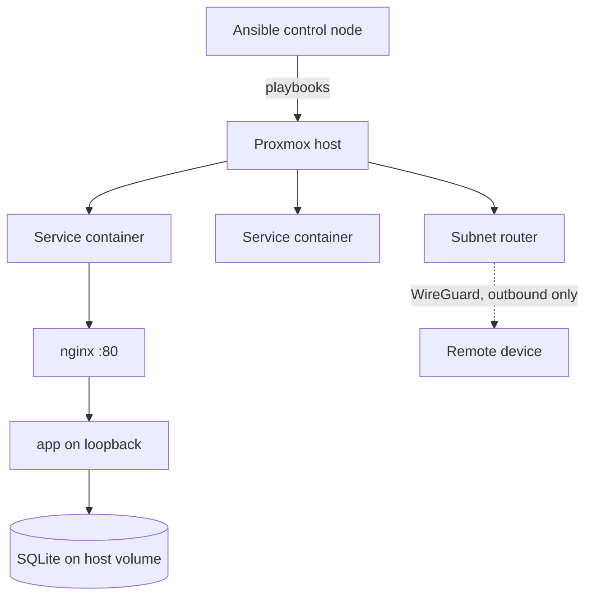

|             |                                        |
| ----------- | -------------------------------------- |
| **Status**  | Running                                |
| **Started** | April 2026                             |
| **Stack**   | Ansible · Proxmox · Debian · systemd · nginx · Tailscale |
| **Scale**   | 13 roles · 5 service hosts · ~2,650 lines of YAML |
| **Source**  | Private repo                           |

## What it is

A small Proxmox server at home, and the Ansible repository that configures every machine
on it. Nothing is set up by hand: each service — DNS filtering, a retro-games box, a
couple of self-hosted web apps — lives in its own lightweight container, and a playbook
turns an empty container into that running service. If a box breaks, the fix is to re-run
the playbook rather than to remember what I clicked.

## Why it exists

I wanted the self-hosted services, but the thing I actually wanted was to stop being the
single point of failure. A homelab configured by hand is a pile of undocumented decisions
that exist only in your head, and the cost shows up months later when something breaks
and you can't reconstruct why it was set up that way.

Writing it as Ansible forces the configuration to be explicit and re-runnable. The
secondary benefit turned out to be the bigger one: infrastructure-as-code is the same
skill whether the target is a homelab or production, so the practice transfers.

## Key decisions

### App-per-container, built on the host — no container images

**Chose:** each service gets its own LXC. Ansible converges it, systemd supervises the
process. No Docker, no image registry, no CI pipeline.

**Because:** the benefits of an image-based workflow scale with team size and service
count, and both are approximately one here. Running Docker *inside* LXC also adds nesting
and privilege complexity that buys nothing at this scale. The container is already the
unit of isolation; adding a second containerisation layer inside it is pure cost.

**Trade-off:** builds happen on the host, so each service box needs a toolchain, and
there's no portable artifact to ship elsewhere. If a host ever has to stay toolchain-free,
or builds get slow enough to want CI, only the checkout-and-build step changes — the rest
of the model stands.

### A pinned git tag is the deployable unit

**Chose:** application repos live separately from the infrastructure repo, referenced by
URL plus a pinned git tag. The playbook checks that tag out into a timestamped release
directory, builds it, applies migrations, flips a `current` symlink, and restarts the unit.

**Because:** this recovers the part of an image workflow that actually matters — an
immutable, named thing you can point at and say "that version is deployed" — without
needing a registry to store it. The tag *is* the image tag.

**Trade-off:** rollback means repointing the symlink at the previous release or re-running
at the old tag. That's a manual step rather than an orchestrator's job, which is fine at
one operator and a handful of services.

### Remote access via outbound-only tunnel, never an open port

**Chose:** a dedicated container advertises the LAN route into a Tailscale tailnet, so
remote devices reach internal addresses directly over WireGuard.

**Because:** it gives remote access without opening a single inbound port on the home
router. The tunnel is established outbound, so from the internet's perspective there is
nothing listening and nothing to find. Services stay bound to the LAN — which also means
no public TLS to manage, since Let's Encrypt needs a reachability that deliberately
doesn't exist here.

**Trade-off:** connectivity now depends on a third-party coordination service, and any
compromised enrolled device gets LAN-level reach.

### Container ID derived from the address

**Chose:** a container's numeric ID matches the last octet of its address, and hostnames
follow a `<service>NN` pattern.

**Because:** it removes a lookup. Knowing any one of ID, hostname or address gives you the
other two, which matters when moving between the Proxmox UI, an inventory file and an SSH
session.

**Trade-off:** only works on a single flat subnet, and breaks quietly if the network is
ever segmented. Cheap to abandon when that happens.

## Threat model

Worth stating plainly, because most of the architecture decisions above are really answers
to this and it's better to be explicit about what I'm defending against than to imply I'm
defending against everything.

**What I'm defending against.** Opportunistic internet-wide scanning, which is the only
attacker that realistically finds a home IP. The answer is that there is nothing to find:
no inbound port is forwarded, and the tunnel is established outbound, so from the outside
the network has no listening service to fingerprint. Secondarily, my own mistakes — an
unrepeatable box that nobody, including me, can reason about six months later.

**What I trust.** Everything on the LAN, and every device enrolled in the tailnet. This is
a flat network with no internal segmentation: a service container can reach any other. That
is a real, deliberate concession — the alternative is VLANs and firewall rules whose upkeep
cost I'd stop paying within a month, and a security control you stop maintaining is worse
than one you never claimed.

**What I accept.**

- **Plaintext HTTP inside the LAN.** No TLS between nginx and the browser. The traffic is
  game scores and my own task list, and the network boundary is the flat itself.
- **A compromised enrolled device gets LAN-level reach.** The subnet router advertises the
  whole LAN, so tailnet access is not per-service. Mitigated only by the tailnet being two
  devices I control.
- **A third-party coordination dependency.** Tailscale's control plane can see the tailnet's
  topology and could, in principle, enrol a device. WireGuard keys stay on the endpoints, so
  it isn't a traffic-interception risk — it is an availability and enrolment-trust risk.
- **No secrets manager.** Secrets live in `ansible-vault` files in the inventory, decrypted
  at play time. Fine for one operator; it doesn't rotate and it doesn't audit.

**What I refuse to accept.** Secrets in git history, and privileged containers. Vault files
hold every credential, deploy keys are read-only and installed `0600` under `no_log`,
containers are unprivileged unless a specific role opts out, and a `clean`/`smudge` git
filter strips real hostnames and addresses out of tracked files so the infrastructure repo
can be published without a history rewrite.

## How it fits together



Playbooks are layered rather than monolithic: provisioning creates the container, a
`common` role applies base configuration, then service-specific roles install the runtime,
deploy the app, and enable a reverse proxy. A new service reuses everything except its own
role.

The deploy model is easiest to read as the task order of a service role. This is the whole
of `roles/life-dashboard/tasks/main.yml` — every service role is this same spine:

```yaml
- name: Ensure the service user and group exist
  ansible.builtin.import_tasks: user.yml

- name: Ensure the on-host directory layout exists
  ansible.builtin.import_tasks: directories.yml

- name: Install the read-only deploy key
  ansible.builtin.import_tasks: deploy_key.yml

- name: Check out the pinned application version
  ansible.builtin.import_tasks: checkout.yml
  tags: [deploy]

- name: Build the release
  ansible.builtin.import_tasks: build.yml
  tags: [deploy]

- name: Apply database migrations
  ansible.builtin.import_tasks: migrate.yml
  tags: [deploy]

- name: Activate the new release      # single symlink swap
  ansible.builtin.import_tasks: release.yml
  tags: [deploy]

- name: Prune old releases
  ansible.builtin.import_tasks: prune.yml
  tags: [deploy]
```

The `deploy` tag is the point of the split: a first run does the whole file, and every
redeploy after that is `--tags deploy` — checkout, build, migrate, flip, prune — leaving
users, directories and keys untouched. "Activate" is one `file: state=link` task, so
go-live is atomic and rollback is the same task pointed at an older release directory.

## Where it stands

Running, and doing real work. Containers and VMs are provisioned from a playbook, a
`common` role applies base configuration across hosts, and a reverse-proxy role is opt-in
per host. Five services are deployed this way — DNS filtering, a retro-games box, the two
[web apps](), and the subnet router that provides remote access.
Secrets are vaulted, and a git filter keeps hostnames and addresses out of commits.

The recovery position is worth stating exactly, because it's the one place the word
"running" could be read too generously. There are no backups: no `vzdump` schedule on the
Proxmox side, and nothing in the playbooks that configures one. What the repo provides is
reproducibility — any container can be rebuilt from scratch by re-running its play — which
restores configuration and not data. For the stateless services that is genuinely the whole
recovery story. For anything holding a database it isn't, and no restore has been performed
to prove otherwise.

## What I learned

**The reasoning is worth more than the automation.** The playbooks are maybe half the
value; the other half is the architecture notes written while deciding — the record of
what was considered and rejected. Six weeks on I could no longer reconstruct why images
were rejected, and the note explaining it was what let me extend the model to a second
service without re-litigating the whole design.

**The second service is where the abstraction gets tested.** The first role is always
over-fitted to its one use case. Deploying a second app of the same shape immediately
exposed which parts were genuinely service-agnostic and which had the first service's
assumptions baked in — and the shape that survived that test is what the
[Web Apps]() page now describes.
