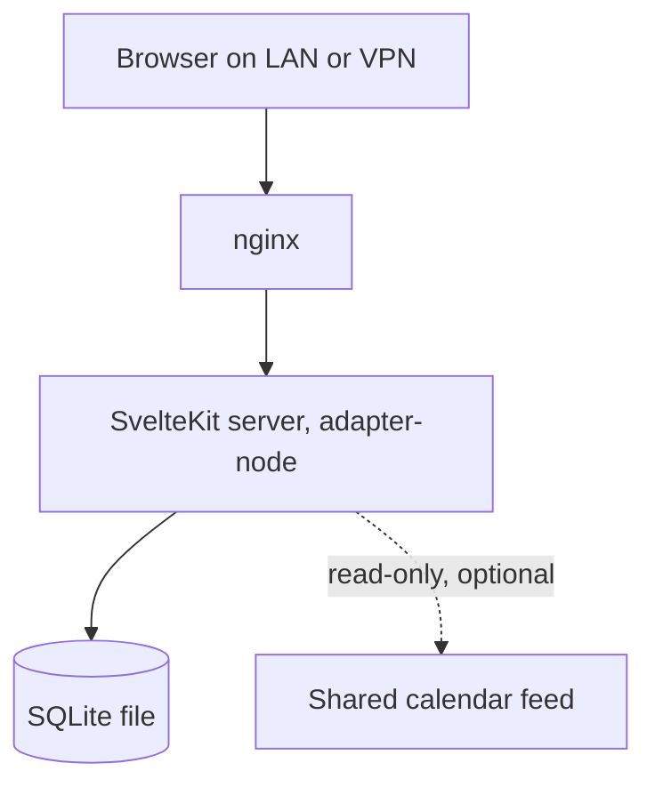

|             |                                          |
| ----------- | ---------------------------------------- |
| **Status**  | Building                                 |
| **Started** | July 2026                                |
| **Stack**   | SvelteKit · TypeScript · SQLite · Node ≥ 22 |
| **Source**  | Private repo                             |

## What it is

One self-hosted web app that holds tasks, university coursework, personal projects, notes,
finances and a weekly study schedule. It runs on the homelab, reachable only from the LAN
or over VPN, and it replaced a Notion workspace plus a separate budgeting app that I'd
written earlier.

## Why it exists

The Notion setup worked until it didn't. Six domains spread across a dozen linked
databases meant that finding anything required remembering where I'd put it, and keeping
it accurate required daily maintenance I stopped doing within a month. A system that
demands upkeep to stay useful is a system you eventually abandon — and abandoning it
quietly is worse than not having it, because you keep half-trusting stale data.

So the constraint came first, before any feature: **two rituals, a morning glance and a
Sunday review, and nothing may demand more than that.** Every module has to earn its place
against that budget. It also absorbed the standalone budgeting app, because "one thing has
exactly one home" only works if there isn't a second app holding one of the domains.

## Key decisions

### Quotas, not clock times

**Chose:** the scheduling module encodes order, duration and weekly quotas — never fixed
times of day as obligations.

**Because:** every previous attempt at a time-blocked schedule failed the same way. One
disrupted morning invalidates the whole day's blocks, the plan is visibly wrong by 10am,
and you stop looking at it. A weekly quota degrades gracefully instead: a missed session
is a number that's behind, not a plan that's broken.

**Trade-off:** less useful if you actually need a schedule enforced against a clock. Hard
appointments deliberately live elsewhere, in a calendar, and are pulled in read-only.

### E-Ink-readable design system, no CSS framework

**Chose:** a hand-written design system with high contrast, no reliance on colour, and
state always shown as symbol *and* word (`✓ ● ◐ ○`). No Tailwind, no component library.

**Because:** I read it on an E-Ink device, where colour is grayscale and low-contrast UI
is unreadable. Every framework default assumes a backlit colour screen. Designing for the
worst display makes it legible on all of them, and "symbol plus word" happens to be the
accessibility-correct answer regardless of the hardware.

**Trade-off:** slower to build, and every component is mine to maintain. Worth it for an
app I use daily on a device most UIs render badly.

### SQLite through Node's built-in module

**Chose:** persistence via `node:sqlite` on Node 22+, rather than an ORM or a native
SQLite addon.

**Because:** the deploy target is a container built on the host, and native addons drag in
a C toolchain and a compile step that can break on a runtime upgrade. A built-in module
has neither. For a single-user app, an ORM's abstraction earns very little against plain
SQL.

**Trade-off:** a newer API with a smaller ecosystem, hand-written queries, and no
straightforward path to another database. Fine — single-user, and Postgres was rejected
as overkill.

### Date-prefixed migrations so it can adopt an existing database in place

**Chose:** migration files are named with a date prefix rather than a plain incrementing
counter.

**Because:** this app takes over the machine and the database that previously ran the
budgeting app, which already had its own migration history with sequential numbers. Date
prefixes let new migrations sort correctly alongside existing entries without colliding
with numbers already recorded — so the old database is adopted in place rather than
exported and rebuilt.

**Trade-off:** ordering within a single day depends on the counter after the date, and the
scheme only makes sense if you know the history. Which is exactly why it's written down
here.

## How it fits together

One language, one process, one database file. Server endpoints, UI and database access all
live in the same SvelteKit app — a separate backend would add a process and a second
language for no gain at this size.

## Status

Built in bricks, each one usable before the next starts:

- [x] Shell, design system, home dashboard
- [x] Tasks
- [x] University: semesters, classes, coursework
- [x] Finances — full port of the earlier budgeting app
- [x] Notes with block editor and quick-capture inbox
- [x] Projects registry
- [x] Curriculum: weekly board and quotas
- [x] Read-only calendar agenda, full-text search, Sunday review flow
- [ ] One-time Notion import, then retire Notion

## What I learned

**Writing the constraints before the features was the highest-leverage hour.** "Two
rituals, nothing more" and "everything has exactly one home" killed several modules before
I built them. Without those written down, I'd have rebuilt the Notion sprawl in a different
tool and called it progress.

**Non-goals deserve to be as explicit as goals.** The spec lists what the app will never do
— no time tracking, no multi-user, no calendar editing, no streak shaming. Every one of
those is a feature I'd otherwise have drifted into on a slow evening, and each would have
broken the daily-upkeep budget the whole design depends on.
