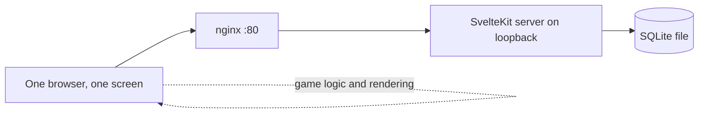

|             |                                             |
| ----------- | ------------------------------------------- |
| **Status**  | Building                                    |
| **Started** | June 2026                                   |
| **Stack**   | SvelteKit · TypeScript · SQLite · Node ≥ 22 |
| **Source**  | Private repo                                |

## What it is

A web app hosting party games I've written, run on the homelab and played on a single
screen in the room — a TV or a laptop everyone can see. Not one-device-per-player. It's
the digital equivalent of a board game on the coffee table.

## Why it exists

Partly to have the games. Mostly because it was the first service I deployed with the
homelab's new delivery model, and I wanted a real application to prove that model against
rather than a toy.

It turned out to be a good study in something else too: how much complexity one honest
constraint lets you delete.

## Key decisions

### One screen, so no real-time layer at all

**Chose:** no WebSockets, no Socket.IO, no lobby or room logic. None of it.

**Because:** exactly one browser connects. Real-time machinery exists to keep multiple
clients in agreement about shared state — with a single client there is no disagreement to
resolve. Every tutorial for this kind of app reaches for Socket.IO by reflex, and adopting
it would have meant a connection lifecycle, reconnection handling, and server-authoritative
state, all to synchronise one client with itself.

**Trade-off:** adding phones as controllers later means building the entire real-time layer
that was skipped. That's a genuine one-way-ish door, and it was worth walking through: the
single-screen format is the point, not a limitation I'm working around.

**This is the decision the whole project rests on.** Nail the usage model first and large
amounts of architecture simply evaporate.

### The backend exists only to remember things

**Chose:** game logic and rendering run entirely in the browser. The server persists
prompts, scores and similar state, and does nothing else.

**Because:** once there's no synchronisation to do, the only thing a server is still needed
for is surviving a page refresh. Keeping that boundary explicit stopped logic drifting
server-side out of habit.

**Trade-off:** everything is client-trusted. Perfectly fine for a party game among friends
in one room; it would be indefensible for anything competitive or public.

### SvelteKit as the whole stack

**Chose:** one SvelteKit app with `adapter-node` — UI, server endpoints and database access
in a single repo and a single process.

**Because:** one language end to end, and for a solo developer the deciding factor is
velocity. A separate backend framework would have added a process and a second language for
no gain at this scale.

**Trade-off:** the frontend and backend can't scale or deploy independently. Neither will
ever need to.

### nginx as a plain reverse proxy

**Chose:** nginx terminates on port 80 and forwards to the Node process on loopback. No
WebSocket upgrade handling, no TLS.

**Because:** having ruled out WebSockets, the proxy config stays trivial. The app is
reachable only over the LAN or VPN, so there's no public certificate to obtain or renew.

**Trade-off:** unencrypted traffic on the local network. Acceptable given the data is game
scores and the network boundary is the flat itself.

## How it fits together

Deployed by the homelab's Ansible role: a pinned git tag is checked out onto its container,
built there, and a symlink flip makes it live. The database file lives outside the release
directory, so redeploys never touch it. See [Homelab](/projects/homelab/) for why that
model was chosen.

## Status

- [x] Deploy model proven end to end — checkout, build, migrate, symlink flip, restart
- [x] Container provisioned and reverse-proxied
- [ ] Game catalogue beyond the first prototypes
- [ ] Score persistence across sessions

## What I learned

**Ask what the usage model actually is before choosing a stack.** The instinct was to reach
for a multiplayer architecture because "party game" pattern-matches to it. One sentence —
everyone looks at the same screen — removed a real-time layer, a state-synchronisation
problem, and a whole category of bugs. The cheapest code is the code you talked yourself
out of writing.

**Writing down what you rejected is as useful as what you chose.** The design notes list
Socket.IO, Postgres, a separate backend and container images as explicit rejections, each
with a reason. When the same questions resurfaced on the [Life Dashboard](/projects/life-dashboard/),
the answers were already there and the second project inherited them in an afternoon.
