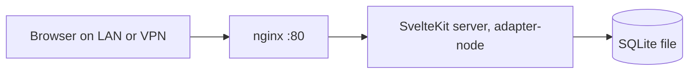

|             |                                             |
| ----------- | ------------------------------------------- |
| **Applies to** | [Life Dashboard]() · [Party Games]() |
| **Stack**   | SvelteKit · TypeScript · SQLite · Node ≥ 22 · nginx |
| **Deployed by** | The [homelab]()'s Ansible role |
| **Reachable** | LAN or VPN only — never the public internet |

## What this page is

Two of my projects are different applications and the same architecture. Rather than argue
the stack twice and let the two copies drift, the shared reasoning lives here and each app
page carries only what makes it different.

That split is itself the point. If two projects genuinely share a shape, the shape deserves
a name and one place to be described — otherwise the second project silently re-decides
everything the first one already settled, and you find out they disagree six months later.

## The shape

That diagram is the whole architecture, and it is the same for both apps. One language, one
process, one database file, one reverse proxy in front.

## Key decisions

### One SvelteKit process is the entire backend

**Chose:** a single SvelteKit app with `adapter-node` — UI, server endpoints and database
access in one repo, one language, one process.

**Because:** for a solo developer the binding constraint is velocity, and a separate backend
service adds a process to supervise, a second language to context-switch into, and an API
contract to keep in sync — in exchange for an independence neither app will ever use. The
server-side of SvelteKit is enough backend for anything one person uses.

**Trade-off:** frontend and backend can't scale or deploy separately, and the framework is
now load-bearing for things frameworks don't usually own. Neither app will ever need the
independence; a rewrite off SvelteKit would be a rewrite of everything.

### SQLite through Node's built-in module, no ORM

**Chose:** persistence via `node:sqlite` on Node 22+ — not an ORM, not a native SQLite
addon, not a database server.

**Because:** the deploy target builds on the host, so native addons drag in a C toolchain
and a compile step that can break on a runtime upgrade; a built-in module has neither. And
at single-user scale a database server is a daemon to supervise, back up and secure in
exchange for concurrency nobody is generating. An ORM's abstraction earns very little
against plain SQL when the schema is small and the queries are hand-shaped.

**Trade-off:** a newer API with a thinner ecosystem, hand-written queries, and no
straightforward path to another database. Postgres was considered and rejected as overkill
in both cases — that would be the migration if either app ever grew concurrent writers,
and it would not be cheap.

### The database is a file, and it outlives the release

**Chose:** the SQLite file lives outside the release directory, on a path the deploy never
touches.

**Because:** it makes a redeploy incapable of destroying data by accident. The release
directory is disposable and gets replaced wholesale on every deploy; the data does not live
there, so there is no version of a bad deploy that takes the database with it.

**Trade-off:** backup is now a separate concern that the deploy does not solve — and, as
the [homelab page]() admits, it is currently not solved at all.

### Migrations are plain forward-only SQL

**Chose:** numbered `.sql` files applied in order at deploy time, with no down-migrations.

**Because:** a rollback that rewrites the schema backwards is a second code path that only
ever runs in an emergency, which is precisely when you least want untested code. Forward-only
means the recovery story is "restore and re-apply", which is the story I'd actually follow.

**Trade-off:** an unwanted migration has to be corrected by writing another migration. No
undo button.

### nginx in front, doing almost nothing

**Chose:** nginx listens on port 80 and forwards to the Node process on loopback. No TLS,
no WebSocket upgrade handling, no caching layer.

**Because:** the app is reachable only over the LAN or the tailnet, so there is no public
certificate to obtain or renew — Let's Encrypt needs a reachability that deliberately
doesn't exist here. What nginx buys at this scale is a stable front door: the Node process
can restart underneath it, and it binds the port so the app never has to run privileged.

**Trade-off:** unencrypted traffic on the local network, and a component in the path that
mostly forwards. Both accepted below.

### Deployment is a pinned git tag and a symlink

**Chose:** the homelab's Ansible role checks out a pinned tag into a timestamped release
directory, builds it there, applies migrations, flips a `current` symlink and restarts the
systemd unit.

**Because:** it recovers the part of a container-image workflow that actually matters — an
immutable, named thing you can point at and say *that version is deployed* — without a
registry to run. Go-live is a single `file: state=link` task, so it's atomic; there is no
window where the app is half-updated.

**Trade-off:** rollback is manual — repoint the symlink or re-run at the previous tag —
and builds happen on the host, so each app container needs a toolchain. The full reasoning,
including what was rejected, is on the [homelab page]().

## When this shape is wrong

It is worth being explicit that this is a house style for a specific situation, not a
general recommendation. It stops working the moment any of these stop being true:

- **One writer.** SQLite's single-writer model is fine for one person and a poor fit the
  moment concurrent writes are real.
- **One operator.** No CI, no image registry and manual rollback are all cheap at one
  person and expensive at three.
- **A trusted network.** Both apps are LAN-only, which is why neither carries auth, TLS or
  a session model. Putting either on the public internet isn't a feature to add, it's a
  different set of assumptions to rebuild against.
- **Data that fits in a file.** The moment the database wants replication or a separate
  host, the one-process model goes with it.

## What I learned

**Two projects are where an architecture stops being a guess.** The first app's decisions
were reasonable but unproven — a set of choices with nothing to compare against. Building
the second one on the same shape is what turned them into an architecture: the parts that
transferred cleanly were genuinely structural, and the parts that needed reworking had been
the first app's assumptions wearing an architecture's clothes.

**Writing down what you rejected pays out on the second project, not the first.** The
design notes list Socket.IO, Postgres, a separate backend service and container images as
explicit rejections, each with a reason. On the first project that felt like bookkeeping.
When the same questions came back on the second, the answers were already there and the
whole stack decision took an afternoon instead of a week.

**Duplicated documentation drifts faster than duplicated code.** Nothing warns you when two
pages describing the same architecture stop agreeing. This page exists because the two app
pages had independently argued the same stack, in slightly different words, with slightly
different emphases — and there is no test that catches that. Deciding *at which level* a
thing is true, and writing it down only there, is the documentation equivalent of not
copy-pasting a function.
